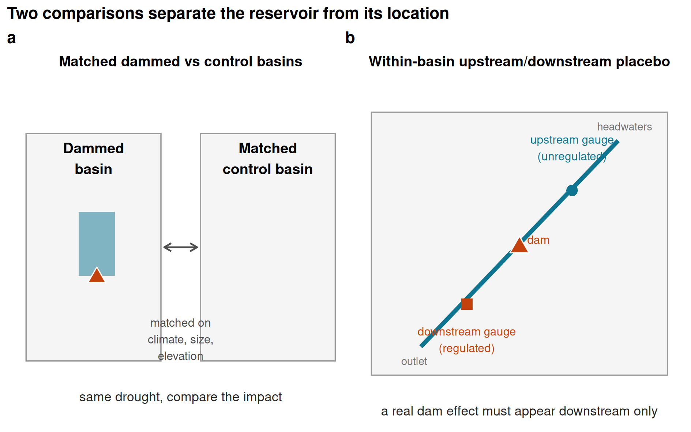

# Results

## Reservoirs sit where water is already scarce

Reservoirs in Chile are built where drought bites hardest: our 21 dammed basins cluster in the arid
centre and north, where irrigation demand and aridity already coincide, so a raw comparison of
dammed against undammed basins would confuse the reservoir with its location. We separate the two
with the design in @fig-schematic. First, we compare each dammed basin only with undammed basins
that share its climate, size and elevation, statistical matching that keeps 21 of 24 dammed basins
against an effective 91 of 244 controls (Supplementary Figs. S4 and S5), and we condition on the
drought each basin actually experienced, so we compare how much impact a basin registers per unit of
meteorological deficit rather than its raw level. Second, within each dammed basin we compare
regulated reaches below the dam against physically unregulated reaches above it. A genuine reservoir
effect must show up in these comparisons; across every pathway, it does not.

```{r}
#| label: fig-schematic
#| out-width: \\textwidth
#| fig-cap: "The two comparisons that separate the reservoir from its location. (a) Matched comparison: each dammed basin is compared only with undammed basins that share its climate, size and elevation, and both are then exposed to the same drought so their impact can be compared. (b) Within-basin placebo: inside a dammed basin, a streamflow gauge below the dam (regulated) is compared with a gauge above it (unregulated); a genuine reservoir effect must appear downstream only. Schematic; the full study-area map and matching diagnostics are in Supplementary Figs. S4 and S5."
#| echo: false

```

## The apparent buffering is the location, not the dam {#sec-placebo}

The most direct and intuitive test is on streamflow. Meteorological drought (SPEI-12) propagates
into streamflow drought (SSI-12) more gently in dammed basins, the visual signature of buffering
(@fig-streamflow, panel a). But this flattening tracks where dams sit, not what they do. If the dam
were doing the buffering, transmission would flatten only below it; instead it flattens just as much
at the unregulated *upstream* reaches of the same basins (differential slope $-0.20$ upstream versus
$-0.16$ downstream; @fig-streamflow, panel b). Because the upstream line flattens too, the cause
must be the aridity of the location, not the reservoir. The national slope gap of $-0.18$
accordingly collapses to about $-0.03$ once dammed and control basins are compared within the same
climate region, and in the high-supply south, where buffering should be easiest to see, the upstream
and downstream gaps are statistically identical ($-0.036$ versus $-0.034$). None survives
randomization inference ($p_{\text{perm}} = 0.39$). The apparent buffering is therefore the
between-region aridity gradient, the textbook signature of a siting confound, not an effect of
regulation; a step-by-step decomposition confirms the signal survives matching and fixed effects but
dies only when basins are compared within climate region (Supplementary Fig. S3 and Table S4).
Upstream and downstream reaches are not perfectly interchangeable, since upstream gauges sit higher
and elevation predicts transmission among controls, but their raw transmission slopes are nearly
identical and the apparent buffering is if anything stronger upstream, neither of which is consistent
with a regulation effect hidden by elevation (Supplementary Table S2).

```{r}
#| label: fig-streamflow
#| fig-cap: "Streamflow buffering is reservoir siting, not regulation. (a) SPEI-12 to SSI-12 transmission for dammed versus matched-control basins (downstream gauges); lines are weighted least-squares fits and shaded bands are 95% confidence intervals; dammed basins show a flatter slope, the apparent buffering. (b) Differential slope (treat:SPEI; <0 = buffering) for intent-to-treat, downstream-only, and the upstream-only placebo; horizontal bars are 95% confidence intervals (estimate +/- 1.96 cluster-robust SE), annotated with randomization-inference p-values. All are permutation-null, and the upstream placebo (above-dam, unregulated) is as strong as downstream, so the attenuation is siting/aridity, not the dam."
#| echo: false
knitr::include_graphics("../../results/figures/fig_streamflow.png")
```

## No reservoir effect survives across any operational pathway {#sec-bounding}

The same answer holds across the other pathways by which reservoirs are thought to modify drought
(@fig-forest, @tbl-main). We measure each effect as the differential response of dammed and
matched-control basins to the same meteorological deficit, and place them on a common axis: each
estimate is divided by its own standard error, so effects on different natural scales (hectares,
evapotranspiration, streamflow) can be read on one plot, and a value inside $\pm 2$ is
indistinguishable from no effect. Every interpretable estimate brackets zero: cross-sectional
irrigated-area expansion ($-0.69$ ha km^-2^, 95% CI $[-2.4, 1.1]$) and evapotranspiration buffering
($-0.014$ $[-0.065, 0.037]$), and the forcing-conditioned slope gaps for irrigated area
($p_{\text{perm}} = 0.91$) and orchard evapotranspiration ($p_{\text{perm}} = 0.24$). One outcome,
whole-basin evapotranspiration, appears positive, but its pre-trends fail and it is confounded by
residual aridity over barren land, so we flag it as uninterpretable rather than fold it silently into
the nulls; at face value it points toward *vulnerability*, not buffering.

This null is informative, not merely underpowered. With about 21 dammed clusters the design cannot
claim exact equivalence to zero, but it rules out streamflow buffering larger than 46 to 58% of
baseline transmission, and a positive control confirms the point: when we inject a known buffering
effect into the treated gauges, the estimator recovers it one-to-one and randomization inference
detects it once it exceeds that threshold (Methods; Supplementary Fig. S2 and Tables S1, S3). The
design would therefore have detected a large operational effect had one existed.

```{r}
#| label: tbl-main
#| tbl-cap: "Reservoir-effect estimates across estimators. Cross-sectional doubly-robust matched ATTs and forcing-interacted DiD slope gaps (treat:SPEI). DiD rows are judged by randomization-inference p-values (p), the design's primary inference at ~21 clusters; cluster-robust CIs are shown for completeness and over-reject here. A positive estimate would indicate induced-demand vulnerability; a negative one, operational buffering. *Whole-basin ET fails its event-study pre-trend test (p approximately 1e-10): its cluster-robust CI excludes zero but the panel is confounded by barren-land aridity, so it is labelled confounded and excluded from the equivalence bounds (Supplementary Table S1)."
#| echo: false
tab <- data.table::fread("../../results/tables/table_main_results.csv")
# Whole-basin ET fails its event-study pre-trends (p~1e-10): the cluster CI excludes zero but the
# panel is confounded (barren-land aridity), so it is neither a clean null nor an interpretable
# effect. Label it honestly rather than "null" (the source verdict is permutation-judged).
tab[outcome == "Whole-basin ET", verdict := "confounded*"]
knitr::kable(tab[, .(Group = group, Outcome = outcome, Estimand = estimand,
                     Estimate = round(estimate, 3),
                     `95% CI` = sprintf("[%.3g, %.3g]", ci_lo, ci_hi),
                     p = ifelse(is.na(p), "-", sprintf("%.2f", p)), Verdict = verdict)])
```

```{r}
#| label: fig-forest
#| fig-cap: "Dammed-versus-control effect across the estimators, each expressed uniformly in its own standard errors (estimate divided by its SE) so the axis metric is identical for every row; an estimate inside +/-2 is indistinguishable from no effect. Rows are grouped by inference regime: cross-sectional matched ATTs (top) and forcing-interacted DiD slope gaps (bottom). Bars span +/-1.96 SE (the 95% reference interval) and dotted lines mark +/-1.96; a positive effect would indicate induced-demand vulnerability, a negative one operational buffering. DiD rows are annotated with their randomization-inference p (the design's valid inference at ~21 clusters, since the +/-1.96 SE guides over-reject there). Every interpretable estimate brackets zero. Whole-basin ET (open symbol, dashed interval) is the sole exception: its estimate/SE exceeds +1.96 and its cluster-robust CI excludes zero, but the panel fails its event-study pre-trend test and is confounded by barren-land aridity, so it is labelled confounded and excluded (@tbl-main); taken at face value it points toward vulnerability, not buffering."
#| echo: false
knitr::include_graphics("../../results/figures/fig_convergent_null.png")
```

## Reservoirs mark, not make, irrigated vulnerability

Dammed basins do carry the vulnerability reservoirs are blamed for concentrating: they hold about
4.6 times more cropland than matched controls (11.1% versus 2.4% of basin area; @fig-area, panel a).
But this gap is a *siting* signature, present and stable across the entire 2000–2024 record, with
dammed and control trajectories evolving in parallel through the megadrought. A dynamic event study
confirms it: the differential trend is flat before 2010 ($p = 0.65$) and does not diverge afterwards
($p = 0.81$; @fig-area, panel b). Reservoirs mark where irrigated agriculture already was; they
neither expanded it nor changed how it responds to drought.

```{r}
#| label: fig-area
#| fig-cap: "Observed irrigated-area dynamics in dammed versus matched-control basins (21 dammed, 244 controls). (a) Entropy-balancing-weighted mean cropland area (% of basin, MapBiomas class 18) with 95% bands (weighted mean +/- 1.96 SE across basins); the y-axis is anchored at zero. Dammed basins hold ~4.6x more cropland (11.1% vs 2.4% of basin area) but the trajectories evolve in parallel. (b) Dynamic event study (dammed x year, reference 2009): the shaded band is the 95% confidence interval (coefficient +/- 1.96 cluster-robust SE). The differential pre-trend is flat (pre-2010 trend-slope p = 0.65) and does not diverge afterwards (post p = 0.81); a linear trend-slope test is used because the joint event-study Wald over-rejects at ~21 treated clusters. The 2010-2024 megadrought is shaded in both panels."
#| echo: false
knitr::include_graphics("../../results/figures/fig_area_did.png")
```

## Storage falls while the seasonal refill holds

If reservoirs neither buffer nor amplify drought, the change that matters under the megadrought is in
how much water there is to store (@fig-storage). Over 2005–2024 the entire storage band drifts
downward in step: annual peak storage falls by 1.3 percentage points of capacity per year
($p = 0.013$) and the trough almost identically ($1.2$ pp yr^-1^, $p < 10^{-4}$), while the seasonal
amplitude is statistically unchanged ($-0.06$ pp yr^-1^, $p = 0.91$; Supplementary Table S5). A band
that drops without narrowing means the reservoirs still refill efficiently each year but from a
shrinking supply, consistent with a falling water-supply ceiling rather than a degraded buffer. This
trend is descriptive, with no control group or naturalized-inflow series, but our most direct demand
proxy weighs against a demand-driven explanation: irrigated area in dammed basins did not expand
(@fig-area, @tbl-main), so a growing consumptive footprint is not evident as the driver
[@li_diminishing_2023; @wang_reservoir_2024].

```{r}
#| label: fig-storage
#| fig-cap: "Storage declines while seasonal refill amplitude holds. (a) Cross-reservoir annual storage band: realized median peak and trough percent-of-capacity (solid lines) with interquartile ribbons across reservoirs, and the peak-trough amplitude (grey dashed). Medians are used because a few reservoirs report storage above nominal capacity (dotted 100% line); the whole band drifts down over 2005-2024 while the amplitude does not narrow. Central lines are the realized medians, not linear fits; the net trend is quantified in (b). (b) Per-year trend slope of peak, trough, and amplitude (reservoir fixed effects); error bars are 95% confidence intervals (estimate +/- 1.96 cluster-robust SE): peak and trough both decline while the amplitude trend is not distinguishable from zero (a wide interval, so statistically unchanged rather than proven constant), consistent with a supply-side level decline rather than refill/buffer degradation. Descriptive: pooled within-reservoir trend, no control group."
#| echo: false
knitr::include_graphics("../../results/figures/fig_storage_band.png")
```
