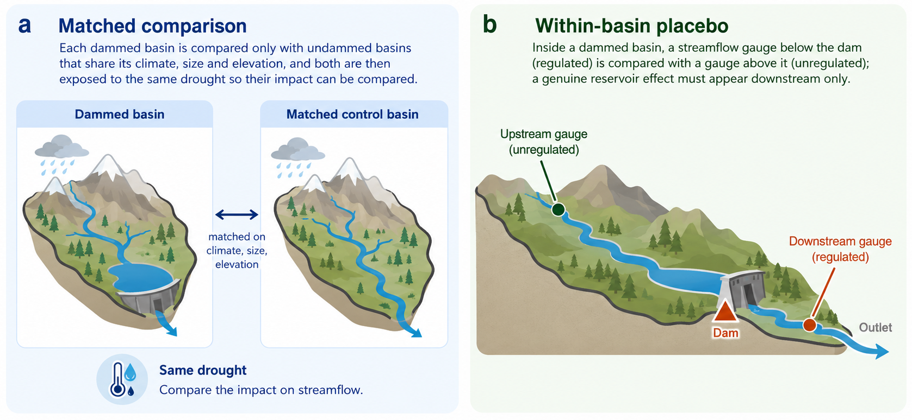
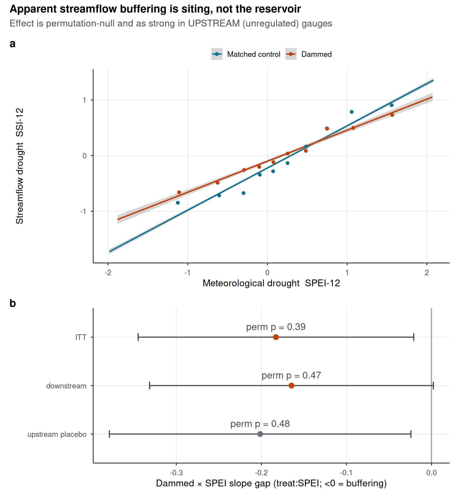
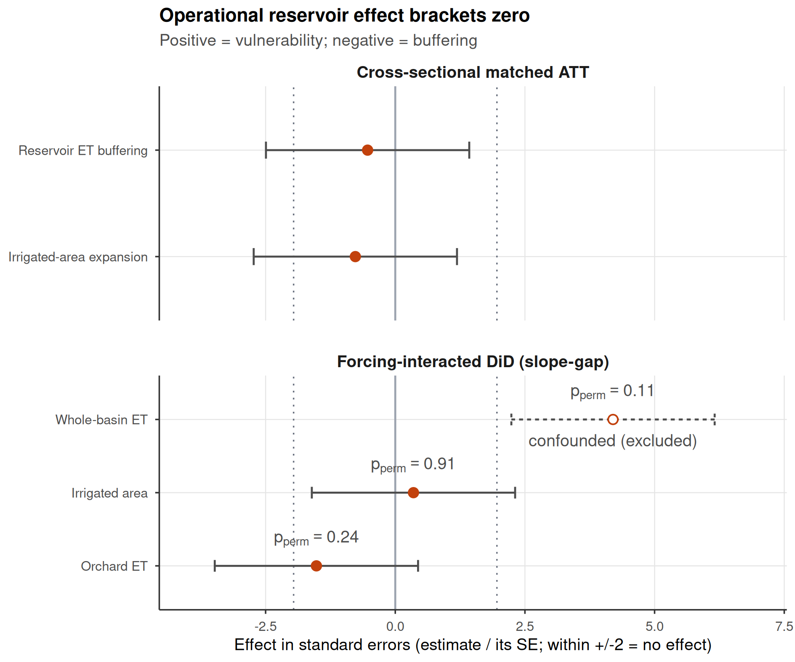
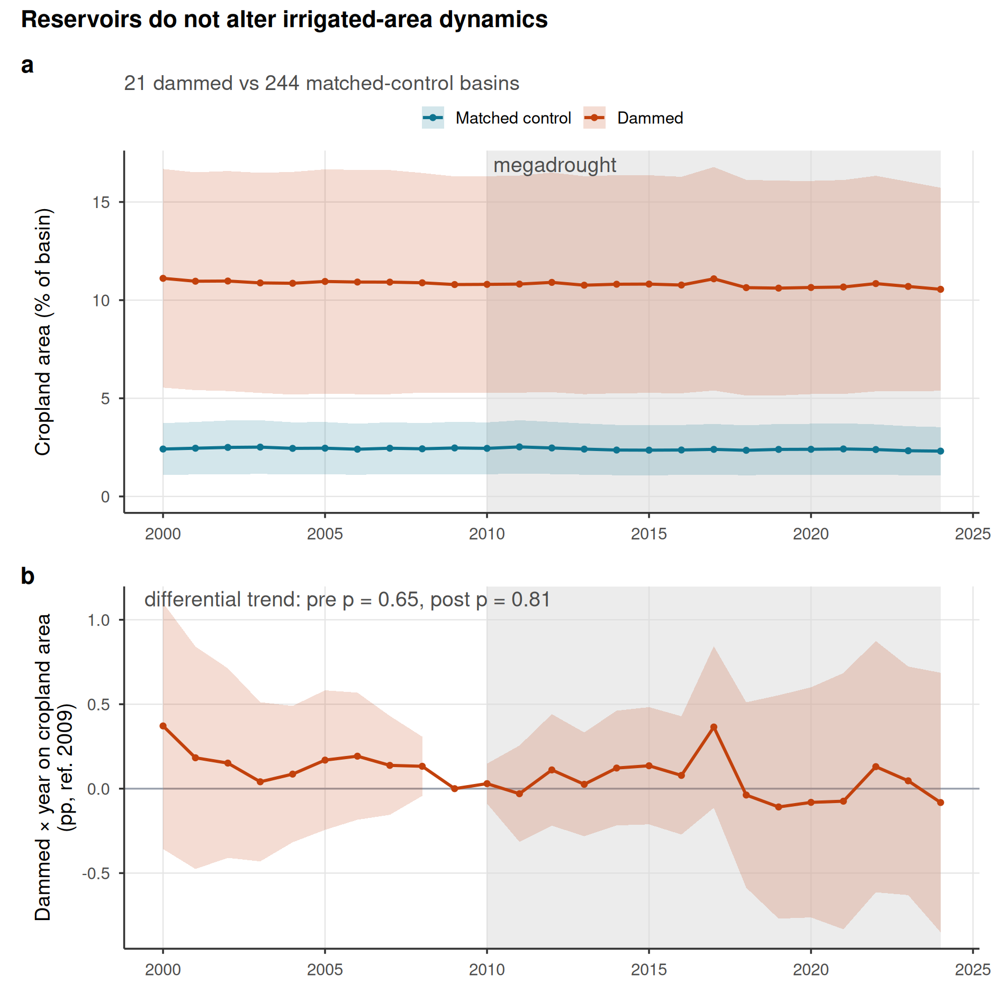
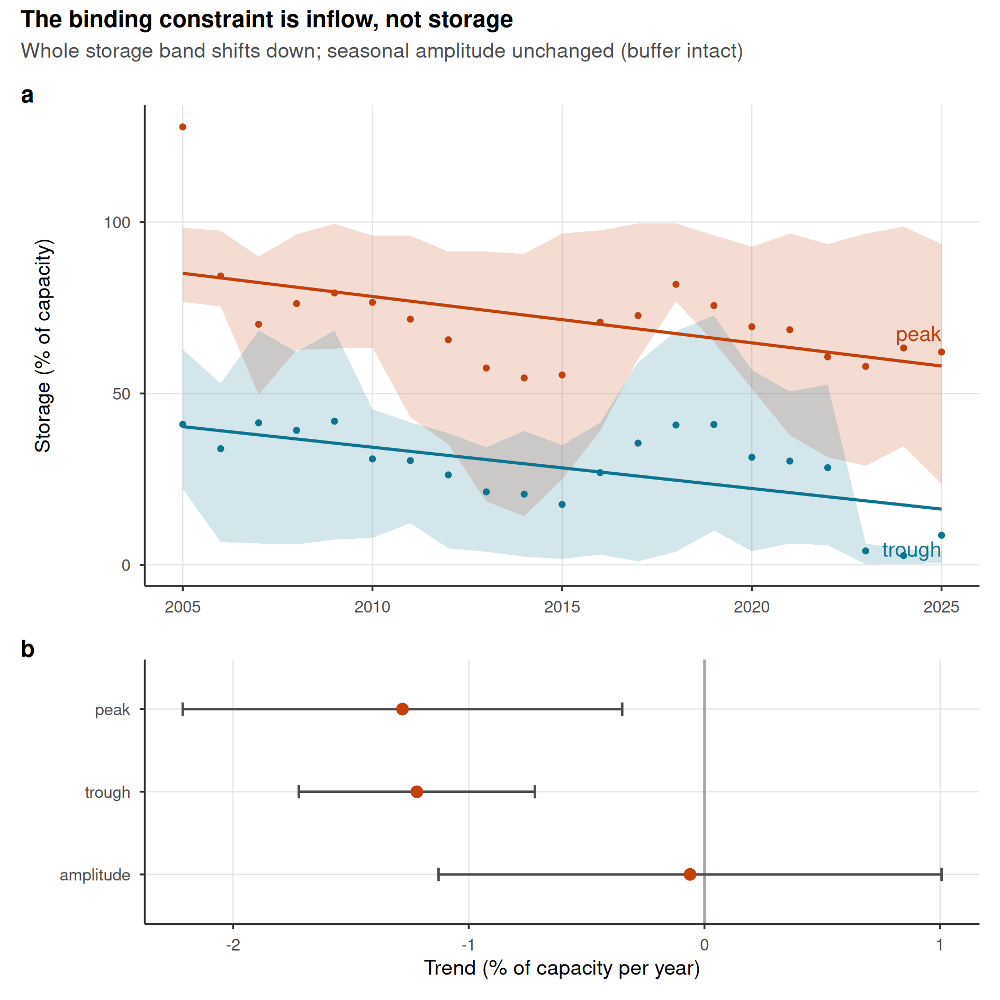

# Results

## Reservoirs sit where water is already scarce

Reservoirs in Chile are built where drought bites hardest: our 21 dammed basins cluster in the arid
centre and north, so a raw comparison would confuse the reservoir with its location. We separate them
with the design in @fig-schematic. First, we compare each dammed basin only with undammed basins
sharing its climate, size and elevation, keeping 21 of 24 dammed basins against
an effective 91 of 244 controls (Supplementary Figs. S4 and S5), and we condition on the
drought each basin experienced, comparing impact per unit of deficit. Second, within each dammed basin we compare
regulated reaches below the dam against unregulated reaches above it. A genuine reservoir
effect must appear in these comparisons; in none does it.

```{r}
#| label: fig-schematic
#| out-width: \\textwidth
#| fig-cap: "The two comparisons that separate the reservoir from its location. (a) Matched comparison: each dammed basin is compared only with undammed basins that share its climate, size and elevation, and both are then exposed to the same drought so their impact can be compared. (b) Within-basin placebo: inside a dammed basin, a streamflow gauge below the dam (regulated) is compared with a gauge above it (unregulated); a genuine reservoir effect must appear downstream only. Schematic; the full study-area map and matching diagnostics are in Supplementary Figs. S4 and S5."
#| echo: false

```

## The apparent buffering is the location, not the dam {#sec-placebo}

The most direct test is on streamflow. Meteorological drought (Standardized Precipitation Evapotranspiration Index of 12 months, SPEI-12) propagates
into streamflow drought (Standardized Streamflow Index of 12 months, SSI-12) more gently in dammed basins, the visual signature of buffering
(@fig-streamflow, panel a). But this flattening tracks where dams sit, not what they do. If the dam
were doing the buffering, transmission would flatten only below it; instead it flattens just as much
at the unregulated *upstream* reaches of the same basins (differential slope $-0.20$ upstream versus
$-0.16$ downstream; @fig-streamflow, panel b). A direct within-basin test of this contrast confirms
it is null: the downstream-minus-upstream difference in the differential transmission slope is
$+0.04$ with a paired permutation $p = 0.72$, so the regulated reaches show no attenuation beyond
the unregulated placebo of the same basins (Supplementary Table S25). The national slope gap of $-0.18$
accordingly collapses to about $-0.05$ once dammed and control basins are compared within the same
climate region, a residual within its own permutation null ($p = 0.65$; Supplementary Table S26), and in the high-supply south, where buffering should be easiest, the upstream
and downstream gaps are identical ($-0.036$ versus $-0.034$). The pooled gap
does not survive
randomization inference, which asks how often reshuffling the dammed label among comparable basins
produces a gap this large by chance ($p_{\text{perm}} = 0.39$). Nor is the pooled slope hiding early buffering:
at drought onset (2010–2014, storage near-full) the upstream and downstream gaps are identical
($-0.43$ both). In the late phase the upstream placebo relaxed substantially (to $-0.21$) while the
noisy downstream estimate (standard error 0.36) did not move, but under the design's permutation
inference neither phase shift is significant (downstream $p = 0.36$, upstream $p = 0.09$) and the
downstream-minus-upstream contrast of the shifts is null ($p = 0.80$; Supplementary Table S27).
The cluster-robust signal of differential weakening does not survive the valid small-cluster
inference, and the temporal pattern is not distinguishable from the shared forcing regime rather
than reservoir depletion. Nor does the linear specification mask a dry-tail effect. A quadratic
SPEI term interacted with treatment is permutation-null ($p = 0.65$), so a nonlinear buffering
signal concentrated in extreme deficits, as threshold-based release rules would produce, is not
detected (Supplementary Table S28). Restricting the transmission models to meteorological
drought months (SPEI < $-1.0$) leaves every buffering estimate and the placebo contrast null
(downstream $-0.20$, $p = 0.71$; upstream placebo $+0.05$, $p = 0.94$; contrast $p = 0.49$), and
at the more extreme threshold (SPEI < $-1.5$) the sample collapses to about 120 unit-months and
the estimates become uninformatively noisy (Supplementary Table S29). The apparent buffering is therefore the
between-region aridity gradient, the signature of a siting confound, not
regulation; a decomposition confirms the signal dies only
when each climate region has its own baseline transmission (Supplementary Fig. S3 and Table S4). Hard-balancing aridity gives the same verdict without parametric adjustment: with
log-aridity fully balanced (effective control sample 19), the apparent buffering vanishes
(intent-to-treat $-0.02$, upstream $-0.05$, permutation $p > 0.85$; Supplementary Table S17),
exactly what a siting confound predicts. This corroborates but does not by itself carry the
result: at an effective control sample of 19, the hard-balanced fit detects only very large
effects (an 80%-power MDE near 77% of baseline, versus 46 to 59% in the primary), so its
contribution is agreement with the powered design rather than independent power, exactly as its
methods note states. The main matched analysis, which retains an aridity residual
(standardized mean difference 0.17), is not left confounded: the doubly-robust outcome model
absorbs that residual, and the decisive within-basin placebo and the within-region comparison
need no aridity balance at all. The parametric adjustment it replaces interpolates
within support, every dammed basin inside the control aridity range (Supplementary Fig. S8). Nor is the null a standardization artifact: SSI is
normalized per gauge, which would divide out dam-induced variance compression, but on log flow
the gaps stay null
(downstream $+0.04$, upstream $+0.10$, permutation $p \geq 0.42$) and downstream relative
variability is uncompressed ($p = 0.43$; Supplementary Table S19). A direct geomorphic metric
agrees: local relief, separating bedrock from alluvial reaches, does not predict control
transmission, leaves the placebo unchanged, and shows no buffering among alluvial units, the
subsample with the fewest alluvial units being illustrative rather than evidentiary (3 treated
upstream and 7 downstream; Supplementary Table S22). Relief adjustment moves the downstream
estimate from $-0.16$ to $-0.20$, toward the upstream placebo value rather than away from it,
which is consistent with the siting interpretation (Supplementary Table S22). Catchment size
cannot manufacture the up/down attenuation either: upstream gauges sit in units of essentially
identical area to downstream gauges (mean 3,156 versus 3,071 km²), and among control gauges the
transmission slope does not vary significantly with log area ($-0.07$ per e-fold, $p = 0.06$,
$n = 84$), with a non-monotonic tercile pattern (0.87, 0.89, 0.73 from small to large;
Supplementary Table S30), so even a weak area sensitivity cannot drive a contrast between
equally sized upstream and downstream catchments. Gauge misclassification cannot manufacture the
contrast either. Downstream gauges are assigned from SRTM elevation relative to the dam, so a
gauge on an unregulated parallel tributary would artificially narrow the down/up contrast.
Against the DGA hydrographic hierarchy, 67 of 70 downstream gauges lie in a sub-cuenca named for
the dam's own river; three sit on a tributary or different river (two on the Duqueco below the
Biobío dams, one on the Itata below the Laja). Excluding those three leaves the contrast null
($D = +0.04$, $p = 0.69$), and excluding the sixteen gauges within 100 m of the dam likewise
leaves it null ($D = +0.12$, $p = 0.47$), moving the downstream estimate toward zero rather than
toward buffering (Supplementary Table S32).

Cumulative catchment scale cannot manufacture the contrast either. The local polygon area does
not capture the drainage integrated by a downstream gauge, but the gauge's own mean discharge,
proportional to cumulative contributing area, does, and larger scale genuinely flattens
transmission among control gauges (slope $+0.08$ per log discharge, $p < 0.001$, $n = 84$;
Supplementary Table S33). Adding a SPEI-by-log-discharge interaction so the differential slope is
net of cumulative scale leaves every effect and the contrast null (intent-to-treat $-0.09$,
$p = 0.50$; downstream $-0.10$, $p = 0.50$; upstream placebo $-0.07$, $p = 0.68$; contrast
$D = -0.03$, $p = 0.74$; Supplementary Table S33). The scale gap is small in most paired basins,
the downstream/upstream discharge ratio below 2 in 10 of 15 (median 1.1), because the downstream
gauges sit just below the dams before large tributaries enter. The paired placebo's power is
likewise disclosed: with 15 basins it detects at 80% power only a downstream-minus-upstream gap
above 0.28 SSI units, about 52% of baseline, so moderate downstream-specific buffering is not
excluded (Supplementary Table S34); the placebo's value is discriminating a regulation signature
from a siting one, which the elevation-, scale-, and misclassification-robust estimates confirm,
not ruling out every buffering magnitude.
Upstream gauges sit higher, and the elevation gradient is real: among control gauges, the
transmission slope flattens with elevation ($-0.21$ per km, $p < 0.001$, $n = 84$), and the
0.54 km mean up/down elevation gap would predict a steeper (more negative) upstream differential
slope of about $0.11$ units. The raw up/down similarity is therefore not decisive on its own, so
we test the placebo directly with the transmission model adjusted for elevation: adding a
SPEI-by-elevation interaction (so the differential slope is estimated net of the geomorphic
gradient) leaves every treatment effect null and the up/down contrast unchanged
(intent-to-treat $-0.20$, $p = 0.30$; downstream $-0.20$, $p = 0.33$; upstream placebo $-0.21$,
$p = 0.39$; contrast $D = +0.02$, $p = 0.89$; Supplementary Table S31). The elevation adjustment
does not reveal a downstream-specific buffering hidden behind the gradient, despite the elevation
term itself being strongly significant. The gradient also cannot manufacture a downstream effect
in the raw comparison: the 0.54 km gap times the control sensitivity already over-explains the
observed $-0.04$ difference, leaving a residual downstream-specific buffering of at most about
$0.07$ (13% of the $0.53$ downstream baseline), well below the 46 to 59% detectable. A piecewise
fit around the Andean snowline (~2000 m) finds no break in this elevation sensitivity
($p = 0.25$; Supplementary Table S20). The placebo's identification therefore does not hinge on
an untested elevation assumption: the confound is quantified, adjusted for directly, and it
cannot produce the downstream-specific buffering a genuine reservoir effect requires
(Supplementary Table S2).

```{r}
#| label: fig-streamflow
#| fig-cap: "Streamflow buffering is reservoir siting, not regulation. (a) SPEI-12 to SSI-12 transmission for dammed versus matched-control basins (downstream gauges); lines are weighted least-squares fits and shaded bands are 95% confidence intervals; dammed basins show a flatter slope, the apparent buffering. (b) Differential slope (treat:SPEI; <0 = buffering) for intent-to-treat, downstream-only, and the upstream-only placebo; horizontal bars are 95% confidence intervals (estimate +/- 1.96 cluster-robust SE), annotated with randomization-inference p-values. All are permutation-null, and the upstream placebo (above-dam, unregulated) is as strong as downstream, so the attenuation is siting/aridity, not the dam."
#| echo: false

```

## The powered nulls exclude operational buffering; demand pathways are bounded {#sec-bounding}

The same answer holds across the remaining pathways that carry evidential weight (@fig-forest,
@tbl-main). Each effect is the
differential response of dammed and matched-control basins to the same deficit, each estimate
scaled by its own standard error, so a value inside $\pm 2$ is
indistinguishable from no effect. Every estimate that carries evidential weight brackets zero:
cross-sectional
cropland-area expansion ($-0.69$ ha km^-2^, 95% CI $[-2.4, 1.1]$) and its forcing-conditioned slope
gap ($p_{\text{perm}} = 0.91$). The evapotranspiration pathway carries no evidential weight and is
excluded rather than counted as a null: whole-basin ET is confounded by barren-land aridity with
failed pre-trends, and the
post-hoc orchard stratum relies on MODIS (Moderate Resolution Imaging Spectroradiometer) MOD16 product, whose documented bias toward zero over irrigated land,
a product property identified independently of our results, disqualifies
its null (Supplementary Table S21, Fig. S7).

The null is informative but its power is concentrated in the streamflow
pathway. With about 21 dammed clusters the design cannot claim exact equivalence to zero but rules
out operational buffering above 46 to 59% of baseline, and a positive control confirms it:
injected buffering is recovered one-to-one and detected beyond that
threshold (Methods; Supplementary Fig. S2 and Tables S1, S3). This is a wide null: moderate
buffering (e.g., a 30 to 40% reduction in transmission) is fully compatible with the data; only
very large effects are excluded, so the finding is no *large* operational buffering, not none. The powered streamflow null covers
the record that ends in March 2020, so it spans the first decade of the megadrought but not the
2019–2022 peak deficits; the storage and cropland pathways, which run to 2024, are the only
multi-year-drought evidence for the late phase. Of the remaining pathways,
only the streamflow null excludes material effects at operationally relevant magnitudes.
The cropland and evapotranspiration designs are far weaker, with minimum detectable effects
far above baseline (7,330% and 237% of baseline, respectively; Supplementary
Table S2); their nulls corroborate rather than independently establish the absence of an effect.
The water-rights count is comfortably null under all inference frameworks ($p_{\text{perm}} \geq 0.42$),
while the winsorized volume is a more nuanced result discussed below.

```{r}
#| label: tbl-main
#| tbl-cap: "Reservoir-effect estimates across estimators. Cross-sectional doubly-robust matched ATTs (including the water-rights induced-demand test) and forcing-interacted DiD slope gaps (treat:SPEI). The DiD row and water-rights accrual are judged by randomization-inference p-values (p), the design's primary inference at ~21 clusters; cluster-robust CIs are shown for completeness and over-reject here. A positive estimate would indicate induced-demand vulnerability; a negative one, operational buffering. Evapotranspiration outcomes are relegated to the Supplementary Information (Table S21, Fig. S7): whole-basin ET is confounded by barren-land aridity with failed pre-trends, and the orchard rows rely on MOD16, whose documented underestimation over irrigated land biases them toward zero."
#| echo: false
tab <- data.table::fread("../../results/tables/table_main_results.csv")
# ET pathway relegated to the SI (Supplementary Table S21): whole-basin ET is confounded
# (barren-land aridity, failed pre-trends) and the orchard rows are MOD16 product-limited.
tab <- tab[!outcome %in% c("Whole-basin ET", "Orchard ET", "Reservoir ET buffering")]
knitr::kable(tab[, .(Group = group, Outcome = outcome, Estimand = estimand,
                     Estimate = round(estimate, 3),
                     `95% CI` = sprintf("[%.3g, %.3g]", ci_lo, ci_hi),
                     p = ifelse(is.na(p), "-", sprintf("%.2f", p)), Verdict = verdict)]) |>
  kableExtra::kable_styling(
    font_size = 6,
    latex_options = "scale_down"
  )
```

```{r}
#| label: fig-forest
#| fig-cap: "Dammed-versus-control effect across the estimators, each expressed uniformly in its own standard errors (estimate divided by its SE) so the axis metric is identical for every row; an estimate inside +/-2 is indistinguishable from no effect. Rows are grouped by inference regime: cross-sectional matched ATTs (top) and forcing-interacted DiD slope gaps (bottom). Bars span +/-1.96 SE (the 95% reference interval) and dotted lines mark +/-1.96; a positive effect would indicate induced-demand vulnerability, a negative one operational buffering. Rows judged by randomization inference are annotated with their p (the design's valid inference at ~21 clusters, since the +/-1.96 SE guides over-reject there). Under that valid inference every estimate brackets zero. Evapotranspiration outcomes are relegated to the Supplementary Information (Table S21) as product-limited and confounded. Water-rights accrual sits outside +/-1.96 by its naive standard error yet is null by the design (p_perm = 0.52; the apparent induced demand lies inside the permutation null expected from the dammed basins' unbalanced aridity, Supplementary Fig. S6)."
#| echo: false

```

## Reservoirs mark prior vulnerability; megadrought divergence is bounded, not absent

Dammed basins carry the vulnerability reservoirs are blamed for concentrating: about
4.5 times more cropland than matched controls (10.8% versus 2.4% of basin area; @fig-area, panel a).
This gap is a *siting* signature, stable across the 2000–2024 record. A dynamic event study
finds the differential trend flat before 2010 (cluster-robust $p = 0.65$, permutation
$p = 0.72$) with no post-2010 divergence detected ($p = 0.81$; @fig-area, panel b).
Both are bounded nulls, not confirmations of parallelism: the pre-trend test
detects only divergence accumulating to about half the control cropland level
by 2009 (the observed trend is a seventh of that), and the permutation envelope widens after
2015, so the late panel cannot rule out substantial divergence (Supplementary Table S14). The null is metric-invariant: on log cropland share the slope gap is
likewise permutation-null ($p = 0.37$; Supplementary Table S20).
Reservoirs mark where cropland already was. The absence of detected divergence is a bounded
null, not a confirmed absence: the design cannot rule out late-panel divergence comparable to
the control cropland level, so within these bounds the record is consistent with no
megadrought-era expansion, but substantial divergence in the later years remains possible.

The same holds for the most direct demand measure. In the Chilean Water Directorate (DGA) registry of consumptive water
rights, dammed basins appear to accrue rights faster than controls, on both
the outlier-robust count ($+20$ per 100 km²; @fig-forest, @tbl-main) and the winsorized volume
($+2.5$ l/s per km²; Supplementary Fig. S6), each with an analytic interval excluding zero. This
is the naive-analysis trap the design catches: dammed basins are more arid, arid basins carry
denser water-rights activity, and the imbalance drives the gap. The count does
not survive randomization inference ($p_{\text{perm}} = 0.52$; Supplementary Fig. S6) and remains
null under a fully non-parametric match on the aridity-overlap subset
($p_{\text{perm}} = 0.42$; Supplementary Table S7). The winsorized volume is more delicate: stable
across thresholds and physically validated (Supplementary Table S8). On the full matched sample
the volume null is insensitive to the winsorization threshold (permutation $p$ from 0.39 to 0.21
across the 95th to 99.9th percentiles), while on the aridity-overlap subset, a smaller sample of
common-support units, the unit-level permutation $p$ falls to $0.005$; the residuals are spatially
autocorrelated (Supplementary Table S9) and under the governing cuenca-block permutation it is not
significant ($p_{\text{perm}} = 0.077$, cuenca-clustered interval $[-0.3, 4.1]$). Ranked raw, uncapped volumes give the same verdict: the design rank contrast is null under
cuenca-block permutation ($p = 0.15$; Supplementary Table S18). The water-rights
evidence is therefore not uniformly null: the count is cleanly so under all frameworks, the
ranked raw volumes are null under spatial inference, and the winsorized volume sits closer
to the boundary, with a unit-level signal ($p = 0.005$) that the spatial structure partially
explains but does not fully erase (cuenca-block $p = 0.077$). The gap between naive and
spatial inference flags the spatial concentration of large consumptive rights in dammed
cuencas, a pattern the design can bound but whose attribution to siting versus
reservoir-induced demand it cannot fully resolve at this spatial grain. No induced demand is
robustly attributable to the reservoir, as measured by the accrual of new state-granted
rights, once siting and spatial structure are accounted for; but the volume signal warrants
further investigation with parcel-level consumption data. The measure covers grants, not the
private market reallocation of existing rights, which in Chile's administratively closed
basins is the channel through which rights actually change hands and which this registry does
not record (Discussion), so no conclusion is drawn about market-driven concentration.

```{r}
#| label: fig-area
#| fig-cap: "Observed cropland-area dynamics in dammed versus matched-control basins (21 dammed, 244 controls). (a) Entropy-balancing-weighted mean cropland area (% of basin, MapBiomas class 18) with 95% bands (weighted mean +/- 1.96 SE across basins); the y-axis is anchored at zero. Dammed basins hold ~4.5x more cropland (10.8% vs 2.4% of basin area) but the trajectories evolve in parallel. (b) Dynamic event study (dammed x year, reference 2009): the grey band is the 95% randomization-inference null envelope (2.5th to 97.5th percentile of the dammed x year coefficients under treatment permutation within Köppen x aridity strata); coefficients inside the band are indistinguishable from no divergence, and cluster-robust intervals are omitted as anti-conservative at ~21 treated clusters. The differential pre-trend is flat (pre-2010 trend-slope cluster-robust p = 0.65, permutation p = 0.72) and no post-2010 divergence is detected (post p = 0.81); a linear trend-slope test is used because the joint event-study Wald over-rejects at ~21 treated clusters. The null envelope widens after 2015, reflecting declining power in the later panel, so the flat post-2015 trajectory is a bounded null: divergence smaller than the envelope cannot be ruled out. The 2010-2024 megadrought is shaded in both panels."
#| echo: false

```

## Storage falls; the carryover buffer shrinks

If the streamflow pathway excludes material operational buffering and the demand-side
pathways are consistent with no amplification at their respective detection limits, what
matters is how much water there is to store (@fig-storage). Over 2005–2024 the storage band drifts
downward: peak storage falls by 1.3 percentage points of capacity per year
($p = 0.013$) and the trough almost identically ($1.2$ pp yr^-1^, $p < 10^{-4}$), while the seasonal
amplitude shows no detectable trend ($-0.06$ pp yr^-1^, $p = 0.91$; Supplementary Table S5). The
unchanged amplitude describes the within-year refill cycle, which is not the buffering mechanism
that matters here. For drought on the multi-year timescale this paper targets, the buffering
mechanism is carryover volume, the water held across years, and the storage level decline directly
shrinks it: peak storage fell from 87% of capacity before 2010 to 67% after, and the trough from
40% to 25% (Supplementary Table S5), so the pool available to buffer a second and third dry year
is materially smaller. This is a real reduction in multi-year buffering capacity. Whether the
decline is supply-driven or management-driven cannot be attributed causally: the trend is
descriptive, has no control group, and is confounded with potential operational or management
changes, so it supports no causal attribution. It is, however, directionally consistent with a
supply-side reading, in which the fall tracks the decline in unregulated inflow rather than a
failure of the reservoirs to refill to their seasonal pattern, which the unchanged amplitude
indicates they still do when water arrives. The direction is
consistent with the supply reduction measured independently in the matched controls, though the
magnitudes differ: unregulated control streamflow fell about 2.9% per year over 2005–2020 (dammed
3.4%), a flux decline larger than the 1.3 pp yr^-1^ fall in the storage stock, as expected since
storage is a buffer that partially absorbs inflow shocks, and the runoff deficit
documented for the megadrought
[@garreaud_20102015_2017; @AlvarezGarreton2021] is an order of magnitude larger in percentage
terms. Storage is a mass balance, so the band alone cannot
separate falling inflows from sustained releases; the supply reading rests on that independent
streamflow decline.
Our direct demand outcomes point the same way: neither cropland area nor water-rights allocation
shows expansion (@fig-area, @tbl-main; Supplementary Fig. S6)
[@li_diminishing_2023; @wang_reservoir_2024].

```{r}
#| label: fig-storage
#| fig-cap: "Reservoir storage declines; the carryover buffer shrinks with supply. (a) Cross-reservoir annual storage band: realized median peak and trough percent-of-capacity (solid lines) with interquartile ribbons across reservoirs, and the peak-trough amplitude (grey dashed). Medians are used because a few reservoirs report storage above nominal capacity (dotted 100% line); the whole band drifts down over 2005-2024 while the amplitude does not narrow. Central lines are the realized medians, not linear fits; the net trend is quantified in (b). (b) Per-year trend slope of peak, trough, and amplitude (reservoir fixed effects); error bars are 95% confidence intervals (estimate +/- 1.96 cluster-robust SE): peak and trough both decline while the amplitude trend is not distinguishable from zero (a wide interval, so statistically unchanged rather than proven constant). The level decline shrinks the carryover water held across years, the multi-year buffering mechanism; the unchanged amplitude shows the within-year refill cycle is intact, so the carryover loss tracks falling inflow, a supply-side decline, rather than a failure to refill seasonally. Descriptive: pooled within-reservoir trend, no control group."
#| echo: false

```
