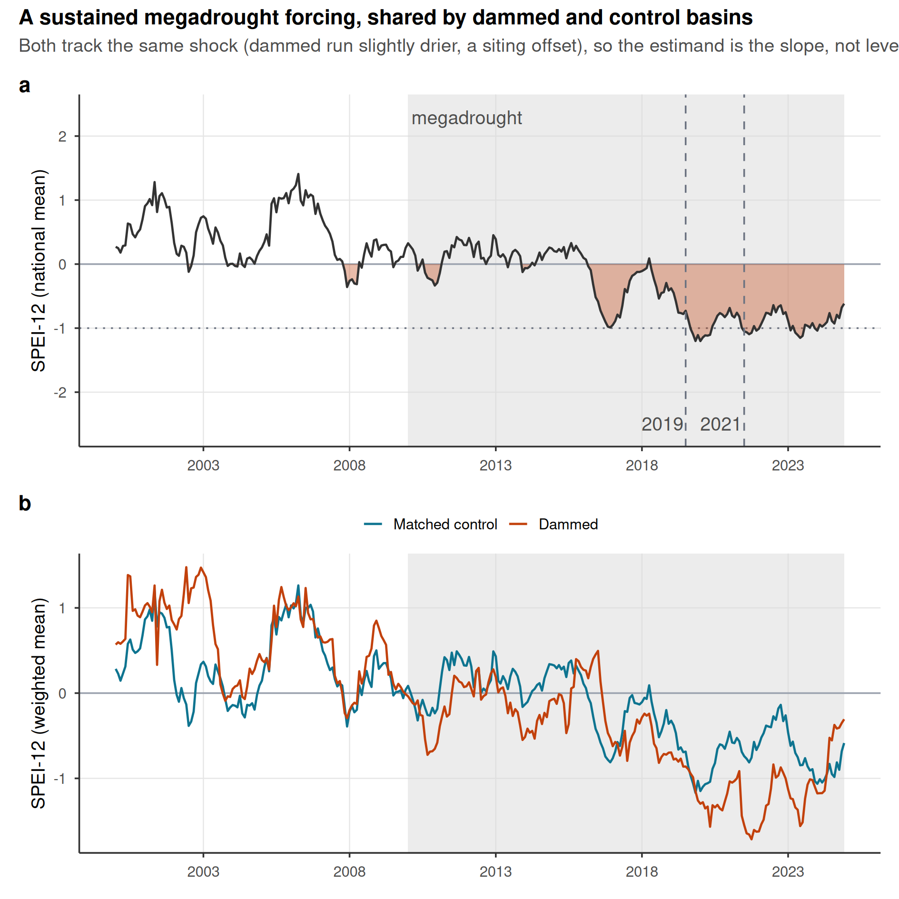
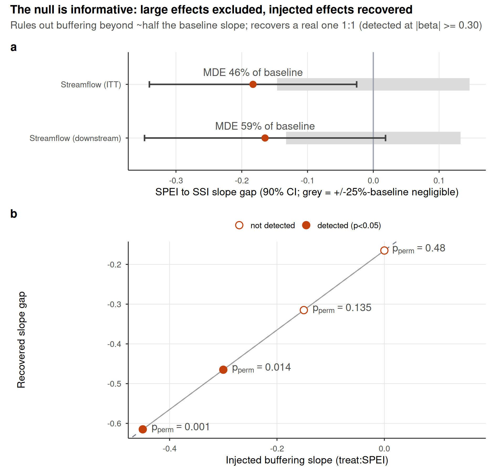
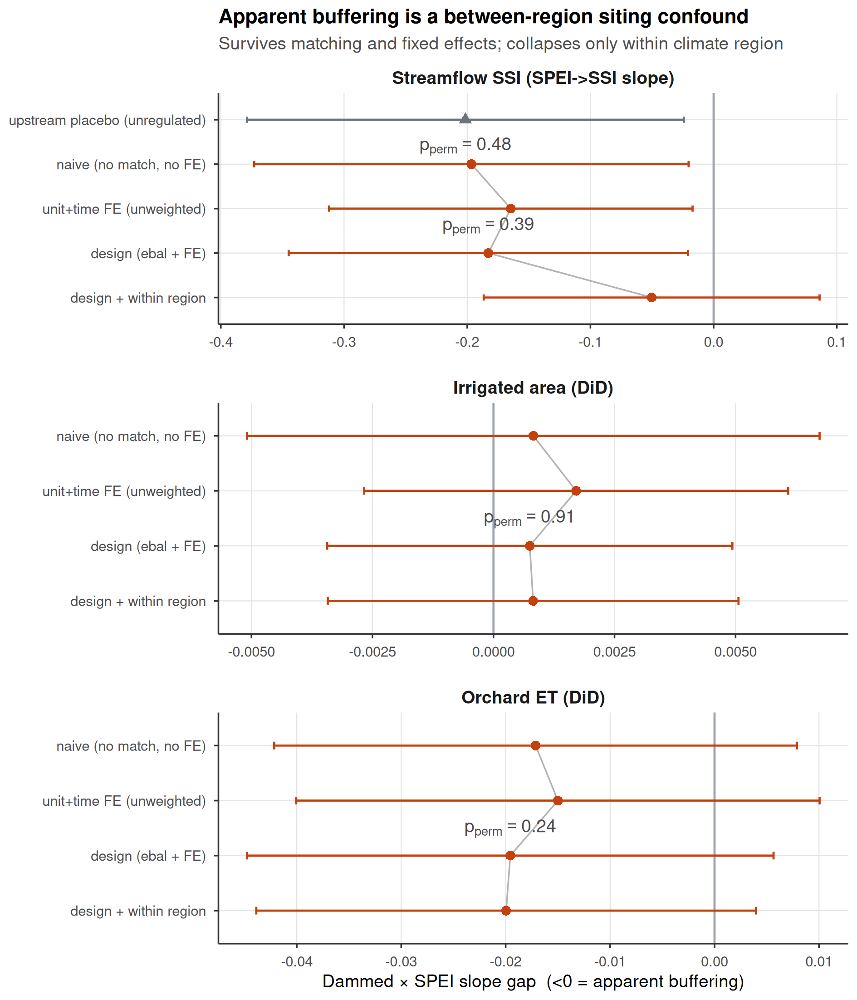
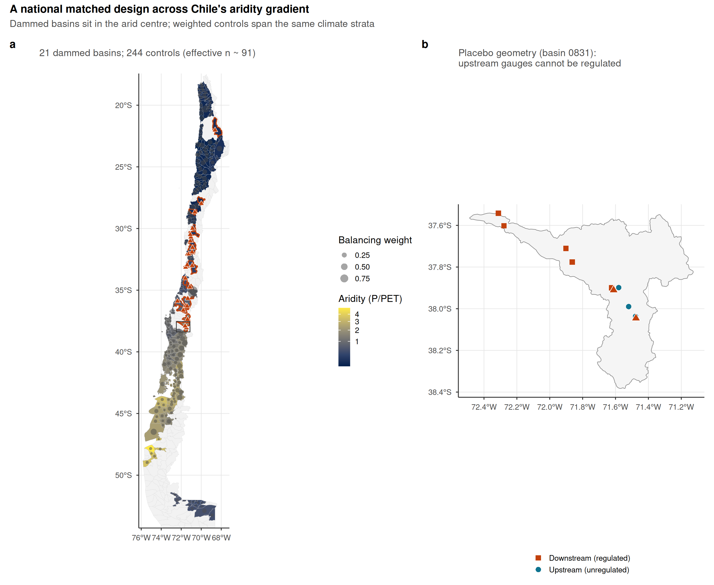
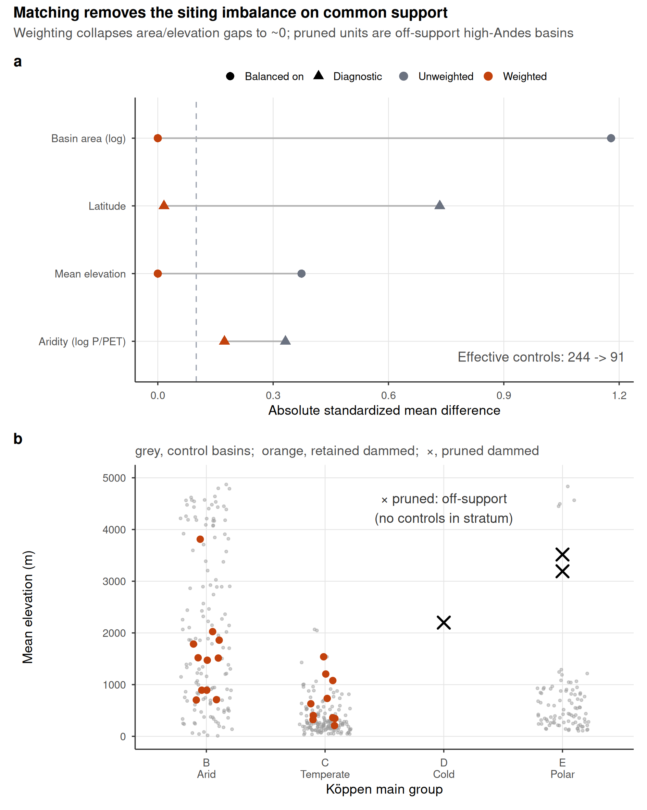
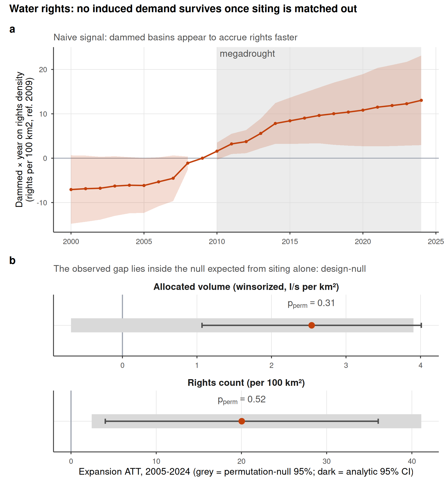
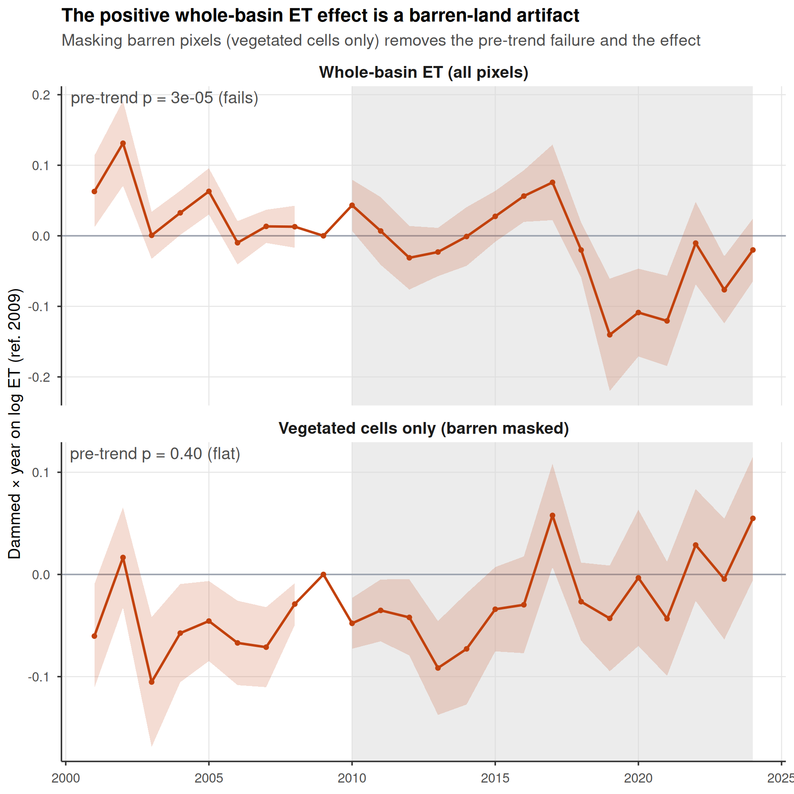

This Supplementary Information collects the supporting design, robustness, and
diagnostic results referenced in the main text. Supplementary Figures S1–S3 document
the drought forcing, the informativeness of the null, and the siting-confound
decomposition; Supplementary Figures S4–S5 give the full study-area map and the matching
diagnostics; Supplementary Figure S6 is the water-rights induced-demand test and Supplementary
Figure S7 the barren-land ET-confound demonstration; Supplementary
Tables S1–S6 report the equivalence bounds, placebo
comparability, positive control, decomposition ladder, storage-band trends, and the aridity-overlap
sensitivity; Supplementary Tables S7–S9 add the fully non-parametric overlap re-match, the
winsorization-threshold sensitivity, and the spatial-autocorrelation assessment with spatially-restricted
inference; Supplementary Table S10 bounds the groundwater-substitution confound with the DGA well
hydrograph network; Supplementary Table S11 tests reservoir-use heterogeneity (irrigation-only
subset); Supplementary Table S12 tests the snowmelt confound on the differential estimand of the
upstream/downstream placebo with standardized ERA5-Land snow-water-equivalent (snow-adjusted refits,
a low-snow subsample, snow-year modulation, and an early/late stability split); Supplementary Table
S13 shows the matching is insensitive to recomputing baseline aridity on the strictly pre-drought
1991–2009 window; Supplementary Table S14 reports the minimum detectable effect for the cropland
pre-trend; Supplementary Table S15 collects the inter-basin spillover (cuenca disjointness) and
administrative-demand checks, including the treated-versus-control closure test; Supplementary
Table S16 translates the equivalence margin into physical streamflow volumes; Supplementary
Table S17 reports the strict hard-balanced aridity sensitivity (effective control sample 19); and
Supplementary Table S18 gives the rank-based tests on raw, uncapped water-rights volumes;
Supplementary Table S19 the volumetric-scale (log-flow) streamflow checks; Supplementary Table S20
the metric and functional-form checks; and Supplementary Table S21 the relegated evapotranspiration
outcomes; Supplementary Table S22 the geomorphological (alluvial) confound check; and Supplementary
Table S23 the carryover-capacity context for the treated reservoirs. All items are regenerated by the `targets` pipeline.

# Supplementary Figures

{width=95%}

**Supplementary Figure S1 | The drought forcing.** (a) National mean SPEI-12 across the
matched basins, 2000–2024; the negative (drought) excursion is filled and the post-2010
megadrought era shaded, with the 2019 and 2021 hyperdrought winters marked. The deficit is
sustained and deep (below −1 for much of 2016–2024), giving the SPEI dose real dynamic range.
(b) Entropy-balancing-weighted mean SPEI-12 for dammed versus matched-control basins: both
co-move through the same megadrought (a common shock that year fixed effects absorb), with
dammed basins running slightly drier, a siting offset that is precisely why the estimand is the
differential deficit-to-impact slope rather than a level or calendar-time contrast.

\clearpage

{width=90%}

**Supplementary Figure S2 | The null is informative, not underpowered blindness.**
(a) Equivalence / minimum-detectable-effect bounds for the two streamflow outcomes: the
observed slope gap (point) and its 90% (TOST) interval against the ±25%-of-baseline negligible
region (grey). The 90% intervals exceed the negligible region, so formal equivalence to zero is
not claimed, but they exclude attenuations larger than the minimum detectable effect (46% of
baseline transmission for the intent-to-treat design, 59% downstream). (b) Positive control: a
known buffering slope injected into the treated downstream gauges is recovered one-to-one by the
estimator (points on the dashed expected-recovery line), the no-injection case is correctly not
flagged, and randomization inference detects the effect (filled points) once the injected slope
reaches −0.30. The estimator would therefore reveal a large operational buffering effect if one
existed.

\clearpage

{width=90%}

**Supplementary Figure S3 | Siting-confound decomposition ladder.** Dammed-versus-control
transmission-slope gap (treat:SPEI; <0 = apparent buffering) estimated by increasingly stringent
estimators, for the streamflow SSI slope (top) and the two difference-in-differences proxy
outcomes; bars are 95% cluster-robust confidence intervals and the design and within-region rows
carry the design's randomization-inference p. Rungs: (1) naive pooled (no matching, no fixed
effects, what a conventional dammed-versus-undammed study reports); (2) unit and time fixed
effects, unweighted; (3) the design estimator (entropy-balance weights + fixed effects); (4)
design with the baseline SPEI-to-outcome slope allowed to vary within climate region. For
streamflow the apparent buffering survives rungs (1) to (3) near −0.18 (permutation-null
throughout), then collapses toward zero at rung (4), and is equally strong at the unregulated
upstream placebo (grey triangle): the signature of a between-region aridity confound, not
regulation. The proxy outcomes carry no signal at any rung.

\clearpage

{width=95%}

**Supplementary Figure S4 | The national matched design across Chile's aridity gradient.** (a)
Matched sample of subcuencas, each filled by long-term aridity (P/PET, the north-south gradient the
design conditions on); dammed (treated) basins are outlined in orange and marked with their
reservoir (triangles), and each matched-control basin carries a centroid dot sized by its
entropy-balancing weight, so the effective control sample (≈91) is visible against the nominal 244.
Dammed basins concentrate in the arid centre and north; weighted controls span the same climate
strata. (b) Within-basin placebo geometry for one representative dammed basin: the reservoir
(triangle) with its downstream (regulated) gauges below the dam and upstream (unregulated) gauges
above it.

\clearpage

{width=90%}

**Supplementary Figure S5 | Covariate balance and common support for the matched design.** (a) Love
plot of the absolute standardized mean difference between dammed and control basins before
(unweighted) and after entropy balancing, for the two balanced covariates (log basin area, mean
elevation) and two untargeted diagnostics (latitude, log aridity); the dashed line is the
conventional 0.1 balance threshold. Weighting collapses the large siting imbalances to ~0, leaving a
small residual aridity difference (0.17) that the doubly-robust outcome model absorbs, and reduces
the effective control sample from 244 to 91. (b) Climate-stratum common support: mean elevation of
control (grey) and dammed (orange, retained) basins within each Köppen main group; the three pruned
dammed basins (x) fall in the cold (D) and polar (E) strata, whose controls lie far below them, so
they are off-support and excluded rather than matched by extrapolation.

\clearpage

{width=85%}

**Supplementary Figure S6 | Water rights show no induced demand once siting is matched out.**
(a) Event study of cumulative consumptive water-rights density (dammed x year, ref. 2009; rights per
100 km2): the dammed-versus-control gap appears to widen through the megadrought, the naive
induced-demand signal. (b) For both the rights count and the winsorized allocated volume, the
expansion ATT (2005-2024; orange point, dark analytic 95% CI) is positive and its analytic interval
excludes zero, yet it lies squarely inside the 95% band of the permutation null (grey), what random
treatment assignment within climate x aridity strata already produces given the dammed basins'
markedly higher aridity, so it is null under randomization inference (p_perm = 0.52 for counts, 0.31
for volume). A conventional matched analysis of this registry would report induced demand; the
design-based inference reveals it as siting.

\clearpage

{width=85%}

**Supplementary Figure S7 | The positive whole-basin ET effect is a barren-land artifact.** Event
studies of the dammed-versus-control evapotranspiration response (dammed x year, ref. 2009) for (a)
whole-basin ET over all pixels, which shows strongly non-parallel pre-trends (pre-trend slope
p = 3x10^-5) and an apparent post-2010 divergence, and (b) ET restricted to vegetated irrigated
(orchard) cells, i.e. with barren and salar pixels masked out. Masking the barren land removes both
the pre-trend failure (p = 0.40) and the positive effect (the forcing-conditioned slope gap moves
from +0.048 to -0.020), confirming that the exclusion of whole-basin ET from the main results is
mechanistic (MOD16 ET is contaminated over sparsely vegetated barren surfaces), not a post-hoc drop
of an inconvenient result.

\clearpage

# Supplementary Tables

**Supplementary Table S1 | Equivalence / minimum-detectable-effect bounds on the headline nulls.**
Observed slope gap, MDE (smallest effect detectable at 80% power from the permutation-null SD),
the 90% (TOST) interval, and whether it lies within the negligible region (±25% of baseline).
"baseline" is the untreated (control) SPEI→SSI / SPEI→impact transmission slope from the
fixed-effects model. No outcome is formally equivalent to zero; the streamflow design rules out
attenuations larger than ~46–58% of baseline transmission.

```{r}
eq <- data.table::fread("../../results/tables/table_equivalence.csv")
knitr::kable(eq[, .(Outcome = outcome,
                    Observed = round(observed, 3),
                    MDE = round(mde, 3),
                    `90% CI` = sprintf("[%.3g, %.3g]", ci90_lo, ci90_hi),
                    `Equiv. to 0?` = ifelse(equivalent, "yes", "no"),
                    `p_perm` = round(p_perm, 2))])
```

\vspace{1em}

**Supplementary Table S2 | Upstream/downstream placebo comparability.** Upstream gauges are
higher than downstream, and gauge elevation predicts the transmission slope among undammed
controls (−0.21 per +1000 m), yet upstream and downstream treated gauges have nearly identical
raw transmission slopes, so the equal up/down attenuation is not an elevation artifact.

```{r}
knitr::kable(data.table::fread("../../results/tables/table_placebo_check.csv"))
```

\vspace{1em}

**Supplementary Table S3 | Positive control on the streamflow estimator.** A known buffering
slope (`beta_injected`; negative = buffering) is added to treated downstream units; the estimator
recovers it (recovered = baseline −0.17 + beta), the no-effect case is not flagged, and
randomization inference detects the effect once it exceeds the minimum detectable effect.

```{r}
knitr::kable(data.table::fread("../../results/tables/table_positive_control.csv"))
```

\clearpage

**Supplementary Table S4 | Siting-confound decomposition ladder (numeric).** The dammed-versus-control
transmission-slope gap at each rung of Supplementary Figure S3, for streamflow SSI (ITT) and the two
difference-in-differences proxy outcomes, plus the within-basin upstream placebo. `perm_p` is the
design's randomization-inference p for the design rung and the placebo.

```{r}
sl <- data.table::fread("../../results/tables/table_siting_ladder.csv")
knitr::kable(sl[, .(Outcome = outcome, Rung = estimator,
                    `Slope gap` = round(slope_gap, 3), SE = round(se, 3),
                    `p_perm` = ifelse(is.na(perm_p), "-", sprintf("%.2f", perm_p)))])
```

\vspace{1em}

**Supplementary Table S5 | Storage-band trends and megadrought level shift.** Top: per-year trend
slope of the cross-reservoir
peak, trough, and peak-trough amplitude (percent of capacity per year; reservoir fixed effects,
cluster-robust). Peak and trough both decline while the amplitude trend is not distinguishable
from zero, consistent with a supply-side level decline rather than a loss of refill capacity.
Bottom: because the storage dynamics are non-linear over a window that begins just before the
megadrought, the linear slope is reported as a summary rate only, and the decline is additionally
characterized as a within-reservoir level shift at the 2010 onset (pre versus post means with
reservoir fixed effects): peak and trough step down significantly while the amplitude shift is
indistinguishable from zero.

```{r}
sb <- data.table::fread("../../results/tables/table_storage_band.csv")
knitr::kable(sb[, .(Component = component,
                    `Trend (%/yr)` = round(100 * slope, 3),
                    `95% CI` = sprintf("[%.3g, %.3g]", 100 * ci_lo, 100 * ci_hi),
                    p = round(p, 3))])
```

```{r}
sp5 <- data.table::fread("../../results/tables/table_storage_period.csv")
knitr::kable(sp5[, .(Component = component,
                     `Pre-2010 mean` = pre_mean, `Post-2010 mean` = post_mean,
                     `Shift` = round(shift, 3),
                     `95% CI` = sprintf("[%.3g, %.3g]", ci_lo, ci_hi),
                     p = signif(p, 2))])
```

\vspace{1em}

**Supplementary Table S6 | Aridity-overlap sensitivity.** Key results re-estimated on the sub-sample
of basins whose baseline log-aridity lies in the treated/control overlap band (all 21 treated basins
and 158 of 244 controls fall inside it), to show the parametric aridity adjustment is not masking a
true effect where common support is genuine. The streamflow transmission-slope gap is essentially
unchanged, and the water-rights expansion ATT shrinks and now straddles zero.

```{r}
ao <- data.table::fread("../../results/tables/table_aridity_overlap.csv")
knitr::kable(ao[, .(Quantity = quantity, `Full sample` = round(full, 3),
                    `Aridity overlap` = round(overlap, 3),
                    `Overlap 95% CI` = ifelse(is.na(overlap_ci_lo), "-",
                                              sprintf("[%.3g, %.3g]", overlap_ci_lo, overlap_ci_hi)))])
```

\clearpage

**Supplementary Table S7 | Fully non-parametric matching on the aridity-overlap subset.** Every
cross-sectional outcome re-estimated after re-fitting entropy balancing *within* the treated/control
aridity-overlap band and using the weighting-only estimator (ebal-weighted difference in means, no
outcome-model aridity term), so the estimate performs no parametric extrapolation across the aridity
regime gap. Cropland-area expansion, orchard-ET buffering and the water-rights count remain null. The
winsorized water-rights volume is the only outcome whose stratified-permutation p falls below 0.05
here; Supplementary Table S9 shows this reflects spatial autocorrelation, not a reservoir effect. The
`perm p` column is the unit-level stratified randomization-inference p (Köppen × aridity tercile).

```{r}
np <- data.table::fread("../../results/tables/table_nonparam_overlap.csv")
knitr::kable(np[, .(Outcome = outcome, ATT = signif(att, 3),
                    `95% CI (HC3)` = sprintf("[%.3g, %.3g]", ci_lo, ci_hi),
                    `p_perm` = round(perm_p, 3),
                    `n_t` = as.integer(n_treated), `n_c` = as.integer(n_control))])
```

\vspace{1em}

**Supplementary Table S8 | Sensitivity of the water-rights volume null to the winsorization
threshold.** The winsorized allocated-volume expansion ATT and its randomization-inference p, with
individual consumptive flows capped at the 95th, 99th, 99.5th (the value used in the main text) and
99.9th percentiles of the consumptive-flow distribution. The analytic interval excludes zero at every
threshold, but the effect is not significant under randomization inference at any threshold
(permutation p from 0.39 to 0.21), so the volume null is not an artefact of the winsorization choice.
The cap is also physically validated (second table): the 99.5th-percentile cap corresponds to
0.3 m³ s^-1^, and in every gauged basin the largest retained right is below the basin's maximum
observed monthly mean streamflow (median ratio 0.002), so no physically impossible values survive
the cap; the uncapped registry maximum, by contrast, exceeds 2×10^8^ l/s.

```{r}
ws <- data.table::fread("../../results/tables/table_winsor_sensitivity.csv")
knitr::kable(ws[, .(`Winsor pctile` = sprintf("%.1f", winsor * 100),
                    `Volume ATT` = round(att, 3),
                    `95% CI` = sprintf("[%.3g, %.3g]", ci_lo, ci_hi),
                    `p_perm` = round(perm_p, 3))])
wp8 <- data.table::fread("../../results/tables/table_winsor_physical.csv")
knitr::kable(wp8[, .(Quantity = quantity, Value = value, Detail = detail)])
```

\vspace{1em}

**Supplementary Table S9 | Spatial autocorrelation and spatially-restricted inference.** Top:
Moran's I of each outcome's ATT-model residuals (great-circle distances, five-nearest-neighbour
row-standardized weights, 999 residual permutations). The water-rights outcomes and cropland area show
significant positive spatial autocorrelation, which the unit-level stratified permutation does not
preserve. Bottom: for the water-rights outcomes, the ATT with its spatially-naive (HC3) interval and
stratified-permutation p alongside the cuenca-block-clustered interval and the spatial-block permutation
p (treatment swapped at the cuenca level). The apparent water-rights volume effect on the overlap
subset (stratified p = 0.005) is not significant once spatial dependence is respected (spatial-block
p = 0.077; cuenca-clustered interval spans zero), and the count is null under both.

```{r}
mo <- data.table::fread("../../results/tables/table_spatial_moran.csv")
knitr::kable(mo[, .(Outcome = outcome, n = n, `Moran's I` = round(moran_I, 3),
                    Expected = round(expected, 3), `p` = round(p_perm, 3))])
si <- data.table::fread("../../results/tables/table_spatial_inference.csv")
knitr::kable(si[, .(Outcome = outcome, ATT = signif(att, 3),
                    `95% CI (HC3)` = ci_hc3, `p (stratified)` = round(perm_p_stratified, 3),
                    `95% CI (cuenca)` = ci_cuenca_clustered,
                    `p (spatial block)` = ifelse(is.na(perm_p_spatial_block), "-",
                                                 sprintf("%.3f", perm_p_spatial_block)))])
```

\clearpage

**Supplementary Table S10 | Groundwater-substitution bound from the DGA well hydrograph network.**
Differential groundwater drawdown between dammed and matched-control basins over the megadrought
(2010–2021). Each well's depletion rate is the OLS slope of Hampel-filtered depth to water on time
(m yr^-1^, positive = falling water table); per-basin rates are aggregated by the outlier-robust
median (primary) and, for robustness, the mean. `dammed` / `control` are the weighted group-mean
rates; `att_wo` is the entropy-balancing weighting-only ATT (with 95% CI and stratified
randomization-inference `perm_p`) and `att_dr` the aridity-adjusted doubly-robust ATT. Coverage is 26
matched basins (13 dammed, 13 control, 213 wells). The differential is not significant in either
specification, and the depletion residuals carry no spatial autocorrelation (`moran_I`, `moran_p`), so
dammed basins show no faster groundwater drawdown of the kind a substitution confound would require.
One scope limitation applies: the DGA monitoring network is not designed around agriculture, so
monitored wells need not sit inside the high-value orchard footprints where compensatory pumping
concentrates, nor sample the same aquifer strata. The basin-median rates therefore bound basin-scale
substitution; field-scale pumping localized outside the monitored network remains a residual caveat.

```{r}
gw <- data.table::fread("../../results/tables/table_gw_substitution.csv")
knitr::kable(gw[, .(Spec = spec,
                    `Dammed (m/yr)` = round(dammed, 3), `Control (m/yr)` = round(control, 3),
                    `ATT (WO)` = round(att_wo, 3),
                    `95% CI` = sprintf("[%.2f, %.2f]", wo_lo, wo_hi),
                    `p_perm` = round(perm_p, 3),
                    `ATT (DR)` = round(att_dr, 3),
                    `Moran I` = round(moran_I, 3), `Moran p` = round(moran_p, 3),
                    wells = n_wells)])
```

\clearpage

**Supplementary Table S11 | Reservoir-use heterogeneity: irrigation-only robustness.** The treated
sample is dominated by irrigation reservoirs (18 of the 21 matched treated basins hold one; three are
purely hydropower or potable supply). The headline streamflow SPEI-to-SSI slope gap (`treat:SPEI`,
< 0 = apparent buffering) is re-estimated on all treated basins and on the irrigation-only subset
(non-irrigation treated basins dropped, controls unchanged), with the design's stratified
randomization-inference p. The slope gap and its permutation-null status are unchanged, so the null is
not an artefact of pooling hydropower with irrigation reservoirs; `n_treat` columns give the treated
basins with streamflow gauges in each case.

```{r}
uh <- data.table::fread("../../results/tables/table_use_heterogeneity.csv")
knitr::kable(uh[!is.na(all_slope), .(Quantity = quantity,
                    `All treated` = round(all_slope, 3), `p (all)` = round(all_perm_p, 3),
                    `Irrigation only` = round(irrig_slope, 3), `p (irrig)` = round(irrig_perm_p, 3),
                    `n_treat (all)` = n_treat_all, `n_treat (irrig)` = n_treat_irrig)])
```

\clearpage

**Supplementary Table S12 | Snowmelt-confound tests on the upstream/downstream placebo, run on the
differential estimand.** Upstream reaches are snow-dominated Andean headwaters, so snowmelt storage
and release could in principle shape the treated-versus-control transmission differential up- versus
downstream independently of regulation. All snow terms use ERA5-Land snow-water-equivalent (SWE)
standardized across units, since the product underestimates absolute Andean snowpack. Four tests
bound the concern: a forcing-by-snowpack adjustment leaves the up/down equivalence intact while
resolving a detectable cross-sectional snow term upstream, so the product is not blind to snow; the
equivalence persists among low-snow units (below-median peak SWE); the apparent buffering does not
strengthen in high-snow years (snow-year modulation); and the treated-versus-control differential is
statistically indistinguishable between the early and late halves of the panel (period interaction
p = 0.46 upstream, 0.52 downstream), providing no evidence of a snow buffer degrading in parallel
with the megadrought. Gauge-level rows cap any snow-induced up-minus-down slope difference at 0.007
against the observed 0.04; these rows are restricted to placebo-basin gauges with SWE coverage, so
gauge counts differ slightly from Supplementary Table S2. Snowmelt is therefore not the driver of
the placebo result.

```{r}
sn <- data.table::fread("../../results/tables/table_snow_placebo.csv")
knitr::kable(sn[, .(Quantity = quantity, Value = value, Detail = detail)])
```

\clearpage

**Supplementary Table S13 | Pre-drought aridity-window sensitivity of the matching.** The 1991–2020
WMO normal used for baseline aridity overlaps eleven megadrought years, so the covariate could in
principle absorb post-treatment variation. Recomputing unit aridity on the strictly pre-drought
1991–2009 window leaves the design unchanged: unit aridity is essentially identical across windows
(Pearson and Spearman rows), 99% of matched units keep the aridity tercile used as a permutation
stratum, and the megadrought change in P/PET (2010–2020 minus 1991–2009) does not differ
significantly between treated and weighted control basins and is an order of magnitude smaller than
the treated-control aridity gap the matching addresses. The matching therefore does not lean on
drought-period or reservoir-influenced variation.

```{r}
aw <- data.table::fread("../../results/tables/table_aridity_window.csv")
knitr::kable(aw[, .(Quantity = quantity, Value = value, Detail = detail)])
```

\clearpage

**Supplementary Table S14 | Minimum detectable effect for the cropland pre-trend.** The flat
pre-2010 differential cropland trend (Fig. 4b) is held to the same equivalence standard as the
headline nulls: the minimum detectable pre-window trend slope is built from the permutation-null SD
(80% power, two-sided alpha 0.05) and cumulated over the 2000–2009 pre-window as a share of the
weighted control cropland level. The design would detect a pre-existing divergence accumulating to
about half of the control cropland level by 2009; the observed differential trend is about a seventh
of the minimum detectable slope.

```{r}
pt <- data.table::fread("../../results/tables/table_pretrend_mde.csv")
knitr::kable(pt[, .(Quantity = quantity, Value = value, Detail = detail)])
```

\clearpage

**Supplementary Table S15 | Inter-basin spillover and administrative-demand checks.** Top rows:
matched treated and effective-control basins occupy entirely disjoint DGA cuencas, so no matched
pair shares a river network and the within-cuenca contamination rule already removes the direct
transfer pathway. The residual transfer bias is bounded in both directions: a transfer moving water
from a dammed basin to a control raises the control's availability and shrinks the estimated gap,
biasing toward the null we report, while imports sustaining a treated basin during peak drought
would flatten the treated transmission slope where deliveries land, downstream, and so mimic
regulation-specific buffering; the absence of any downstream-specific flattening in the placebo
bounds this direction too, though a vulnerability signal partially offset by imports cannot be fully
excluded without an explicit transfer-network model. Bottom rows: the water-rights registry was not
closed during the megadrought, and
the closure that would matter, a freeze specific to dammed basins, is absent: treated basins entered
the drought with a higher allocated stock per unit area than their weighted controls, accrued new
rights about 2.7 times faster through the megadrought, and none went without new grants, while 29%
of weighted controls did. The demand-side null is therefore a genuine null difference, not the
forced silence of saturated registries.

```{r}
sp <- data.table::fread("../../results/tables/table_spillover_demand.csv")
knitr::kable(sp[, .(Metric = metric, Value = value, Detail = detail)])
```

\clearpage

**Supplementary Table S16 | Physical-volume translation of the equivalence margin.** The ±25%
equivalence margin corresponds at the worst observed deficit to a perturbation of 0.29 SSI units
(Methods). Translated through each treated downstream gauge's within-gauge linear sensitivity of the
12-month rolling mean flow to its SSI, that perturbation corresponds to the volumes below, expressed
per 12-month season and as a share of mean annual flow. The linear sensitivity is an average rather
than a dry-tail mapping and therefore overstates the worst-drought volume; even so, the median is of
order tens of cubic hectometres, a volume that is material for local water management. This is why
the margin is anchored to the operational drought-severity classification rather than to volumetric
negligibility, why the threshold-free minimum detectable effect is reported alongside, and why the
causal weight of the null rests on the within-basin placebo rather than on the equivalence verdict.

```{r}
mv <- data.table::fread("../../results/tables/table_margin_volume.csv")
knitr::kable(mv[, .(Quantity = quantity, Value = value, Detail = detail)])
```

\clearpage

**Supplementary Table S17 | Hard-balanced aridity sensitivity.** The primary design deliberately
leaves a residual aridity imbalance (SMD 0.17) to the doubly-robust outcome model because
hard-balancing aridity collapses the effective control sample from 91 to about 19. Here the strict
alternative is reported: entropy balancing that targets log baseline aridity alongside log area and
elevation within Köppen group, achieving SMD 0.000 with no parametric extrapolation across the
hydroclimatic regime gap. Every headline result is unchanged or strengthened: the streamflow slope
gap and the upstream placebo collapse essentially to zero, and the cropland and water-rights
outcomes remain null. That even the *apparent* buffering vanishes when aridity is fully balanced is
the direct signature of a siting confound rather than a reservoir effect.

```{r}
hb <- data.table::fread("../../results/tables/table_hard_balance.csv")
knitr::kable(hb[, .(Quantity = quantity, Value = value, Detail = detail)])
```

\clearpage

**Supplementary Table S18 | Rank-based tests on raw, uncapped water-rights volumes.** Rights
volumes are extremely concentrated and carry known data errors, which is why the level analysis
winsorizes; rank-based statistics are immune to caps, outliers, and any monotone error in extreme
caudal entries. The per-right volume distribution is nearly identical in dammed and control basins
at the median, so the count density does not systematically understate demand in dammed basins. The
naive basin-level rank gap in raw added volume reproduces the siting gap, as with the count; the
design contrast (ebal-weighted mean-rank difference) appears significant under unit-level
permutation, which is anti-conservative given the strong spatial autocorrelation of water-rights
outcomes (Supplementary Table S9), and is not significant under the governing cuenca-block
permutation, matching the winsorized-volume verdict.

```{r}
wr18 <- data.table::fread("../../results/tables/table_wr_rank.csv")
knitr::kable(wr18[, .(Quantity = quantity, Value = value, Detail = detail)])
```

\clearpage

**Supplementary Table S19 | Volumetric-scale streamflow checks.** SSI standardizes each gauge on
its own, for regulated gauges post-dam, flow distribution, so the transmission slope tests
distribution-relative propagation and would divide out any dam-induced compression of flow
variance. Two direct checks show the streamflow null is not a standardization artifact. First, the
buffering models and the upstream placebo are re-estimated on log 12-month mean flow, a volumetric
semi-elasticity (percent of flow per SPEI unit) that no per-gauge normalization can compress: all
slope gaps remain permutation-null, with point estimates slightly positive (toward steeper, not
buffered, transmission) and the upstream placebo at least as large as downstream, reproducing the
siting pattern. Second, the compression premise itself: deseasonalized log-flow variability at
regulated downstream gauges is statistically indistinguishable from unregulated upstream gauges
(Wilcoxon p = 0.43), so there is no differential variance compression for the standardization to
divide out at the monthly-to-annual scale our design resolves.

```{r}
vc <- data.table::fread("../../results/tables/table_volumetric.csv")
knitr::kable(vc[, .(Quantity = quantity, Value = value, Detail = detail)])
```

\clearpage

**Supplementary Table S20 | Metric and functional-form checks.** Top: the baseline SPEI-to-SSI
transmission slope among undammed controls varies smoothly and monotonically across aridity
terciles, with no regime break for the linear log-aridity adjustment to misfit. Middle: the control
elevation sensitivity of transmission shows no detectable nonlinearity across the ~2000 m snowline
(piecewise interaction p = 0.25); the snow regime itself is tested directly on the placebo estimand
in Supplementary Table S12. Bottom: the cropland null is metric-invariant: re-fit on log cropland
share (relative rather than absolute expansion), the forcing-DiD slope gap remains
permutation-null.

```{r}
mc <- data.table::fread("../../results/tables/table_metric_checks.csv")
knitr::kable(mc[, .(Quantity = quantity, Value = value, Detail = detail)])
```

\clearpage

**Supplementary Table S21 | Evapotranspiration outcomes (relegated from the main text).** The ET
pathway is reported here with its caveats and carries no evidential weight in the paper's
conclusions. Whole-basin ET fails its event-study pre-trend test (differential pre-2010 trend p
approximately 3e-5) and is confounded by residual aridity over barren land; masking barren pixels
removes both the pre-trend failure and the positive effect (Supplementary Fig. S7), but the
resulting orchard stratum was defined post hoc and relies on MOD16, whose documented
underestimation of ET over irrigated land biases its slope gap toward zero, disqualifying a null as
evidence in a null-finding design. A thermal ET product (Landsat SSEBop/METRIC or ECOSTRESS class)
is the way to test the consumptive-use pathway properly and is flagged as future work.

```{r}
et21 <- data.table::fread("../../results/tables/table_main_results.csv")
et21 <- et21[outcome %in% c("Whole-basin ET", "Orchard ET", "Reservoir ET buffering")]
knitr::kable(et21[, .(Group = group, Outcome = outcome, Estimand = estimand,
                      Estimate = round(estimate, 3),
                      `95% CI` = sprintf("[%.3g, %.3g]", ci_lo, ci_hi),
                      p = ifelse(is.na(p), "-", sprintf("%.2f", p)))])
```

\clearpage

**Supplementary Table S22 | Geomorphological (alluvial) confound check on the placebo.** The
up/down contrast coincides with the bedrock-to-alluvial transition, and elevation is only a proxy
for it, so a direct terrain metric is extracted: local relief, the maximum minus minimum SRTM
elevation within 2.5 km of each gauge, a standard discriminator of bedrock canyons (high relief)
from alluvial valleys (low relief). The up/down relief gap is real (about 0.7 SD), but relief does
not predict the transmission slope among undammed controls (p = 0.41; marginal at p = 0.08 net of
elevation), a relief-by-forcing adjustment leaves both placebo coefficients essentially unchanged,
and among low-relief (alluvial) units neither the upstream nor the downstream contrast shows any
buffering (both positive and null, on few treated units). Alluvial storage therefore neither
manufactures the upstream attenuation nor masks a downstream reservoir effect; relief at 2.5 km
cannot resolve aquifer storage volumes themselves, which remain a residual caveat.

```{r}
gm <- data.table::fread("../../results/tables/table_geomorph.csv")
knitr::kable(gm[, .(Quantity = quantity, Value = value, Detail = detail)])
```

\clearpage

**Supplementary Table S23 | Carryover capacity of the treated reservoirs.** Whether the 12-month
null tests a function the dams were designed to perform is answerable from the project's own data.
The median treated reservoir stores about 0.3 years of mean annual downstream flow, seasonal-scale
by design, but seven of the 17 reservoirs with a gauged downstream unit hold at least half a year
and four hold more than a full year of flow; and seasonal operation does not empty the fleet, whose
pre-2010 annual trough averaged 39% of capacity, so storage persisted across years. Interannual
carryover was therefore physically available to a substantial subset, and the multi-year null is
not a deterministic consequence of purely seasonal design; the irrigation-only restriction
(Supplementary Table S11) additionally shows the result is not diluted by reservoir purpose.
Downstream flow is regulated, so the ratios are approximate.

```{r}
co <- data.table::fread("../../results/tables/table_carryover.csv")
knitr::kable(co[, .(Quantity = quantity, Value = value, Detail = detail)])
```
