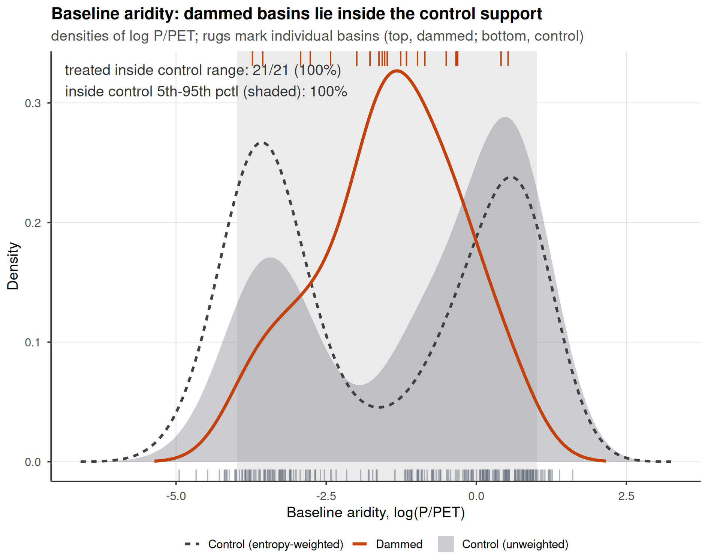

This Supplementary Information collects the supporting design, robustness, and diagnostic results
referenced in the main text, numbered in the order the main text first cites them.

Supplementary Figure S1 is the water-rights induced-demand test and Supplementary Figure S2 the
non-parametric aridity common-support check; Supplementary Figures S3 and S4 give the full
study-area map and the matching diagnostics; and Supplementary Figure S5 documents the drought
forcing, Supplementary Figure S6 the siting-confound decomposition, Supplementary Figure S7 the
barren-land evapotranspiration (ET) confound demonstration, and Supplementary Figure S8 the
informativeness of the null.

Supplementary Table S1 tests reservoir-use heterogeneity (irrigation-only subset), Supplementary
Table S2 collects the inter-basin spillover (cuenca disjointness) and administrative-demand checks
including the treated-versus-control closure test, and Supplementary Table S3 screens the matched
controls against the 1,370-dam national inventory and re-fits the streamflow results with a
re-balanced dam-free control pool. The storage-band series follows: Supplementary Table S4 re-fits
the trends weighted by reservoir capacity and in absolute fleet volumes, Supplementary Table S5 on
the coverage-stable reservoir subset, and Supplementary Table S6 confirms every trend, step, and
drift coefficient with a null-imposed wild cluster bootstrap, the small-cluster refinement
appropriate to the 22 to 26 reservoir clusters. Supplementary Tables S7 to S9 harden the carryover
contrast with the ratio-denominator sensitivity (unregulated upstream flow), the strictly-paired
contrast, and the hydropower-excluded and leave-one-out inference.

Supplementary Table S10 quantifies the drought-conditional structure of streamflow missingness,
Supplementary Table S11 re-derives the streamflow results with the Standardized Streamflow Index
(SSI) standardized on the 1990–2020 baseline, and Supplementary Table S12 gives the
volumetric-scale (log-flow) checks. Supplementary Tables S13 and S14 report the
winsorization-threshold sensitivity and the rank-based tests on raw, uncapped water-rights volumes.
Supplementary Table S15 tests the snowmelt confound on the differential estimand of the
upstream/downstream placebo with standardized ERA5-Land snow water equivalent (snow-adjusted
refits, a low-snow subsample, snow-year modulation, and an early/late stability split),
Supplementary Table S16 collects the relegated ET outcomes, and Supplementary Table S17 bounds the
groundwater-substitution confound with the Dirección General de Aguas (DGA) well hydrograph
network.

The matching diagnostics run from Supplementary Table S18 to Supplementary Table S26: the
pre-drought aridity-window sensitivity, the aridity-overlap sensitivity and its fully
non-parametric re-match, the metric and functional-form checks, the non-linear aridity-by-forcing
sensitivity, the strict hard-balanced fit (effective control sample 19) with its weight diagnostics
and leave-one-out sensitivities, the smooth cubic national time trend, and the physical-volume
translation of the equivalence margin. Supplementary Table S27 assesses spatial autocorrelation and
reports spatially-restricted inference, and Supplementary Table S28 the permutation inference for
the within-region (siting-ladder rung 4) residual.

The placebo battery spans Supplementary Tables S29 to S46: the direct within-basin contrast and its
elevation-partitioned permutation null; the comparability audit with its catchment-area,
elevation-adjusted, cumulative-scale (discharge-adjusted), and geomorphological checks; the
gauge-classification robustness, the routed-network (HydroRIVERS) validation, and the cascade-dam
contamination screen against the 1,370-dam inventory; the non-linear (quadratic) and dry-tail
transmission tests; the early/late megadrought phase split and its permutation inference; the
downstream extraction-masking bound, the placebo net of an interaction between the Standardized
Precipitation Evapotranspiration Index (SPEI) and local cropland, and the sub-watershed SPEI
exposure-misclassification bound; and the paired contrast's own power.

Supplementary Tables S47 to S49 give the siting-confound decomposition ladder in numeric form, the
positive control on the streamflow estimator, and the equivalence and minimum detectable effect
bounds on the headline nulls. Supplementary Table S50 reports the storage-capacity (carryover)
heterogeneity of the buffering test, Supplementary Table S51 the minimum detectable effect for the
cropland pre-trend, Supplementary Tables S52 and S53 the storage-band trends with the megadrought
level shift and its step-versus-trend decomposition, and Supplementary Table S54 the carryover
capacity of the treated reservoirs. All items are regenerated by the `targets` pipeline.

# Supplementary Figures

{width=85%}

**Supplementary Figure S1 | Water rights show no induced demand once siting is matched out.**
(a) Event study of cumulative consumptive water-rights density (dammed x year, ref. 2009; rights per
100 km2): the dammed-versus-control gap appears to widen through the megadrought, the naive
induced-demand signal. (b) For both the rights count and the winsorized allocated volume, the
expansion average treatment effect on the treated (ATT; 2005–2024; orange point, dark analytic
95% CI) is positive and its analytic interval
excludes zero, yet it lies squarely inside the 95% band of the permutation null (grey), what random
treatment assignment within climate x aridity strata already produces given the dammed basins'
markedly higher aridity, so it is null under randomization inference (p_perm = 0.52 for counts and
0.31 for the winsorized volume, both estimated on the full matched sample with the
99.5th-percentile cap under unit-level stratified permutation; the threshold sensitivity is
Supplementary Table S13, and the aridity-overlap subset with its spatial-block inference, a
different sample and permutation scheme, is Supplementary Table S27). A conventional matched
analysis of this registry would report induced demand; the design-based inference reveals it as
siting.

\clearpage

{width=80%}

**Supplementary Figure S2 | Baseline aridity: non-parametric common support.** Densities of
long-term baseline aridity, log(P/PET), for control basins (grey area, unweighted; dashed line,
entropy-weighted) and dammed basins (orange), with per-basin rug marks (top, dammed; bottom,
control). The dammed basins are systematically more arid than the unweighted control mean, the
residual imbalance (SMD 0.17) that the doubly-robust outcome model adjusts parametrically; this
plot shows the adjustment is interpolation, not extrapolation. All 21 dammed basins lie inside the
control range and inside the control 5th–95th percentile band (shaded), and the control density is
strictly positive across the entire treated support, so no treated unit relies on out-of-support
extrapolation. The hard-balanced sensitivity (Supplementary Table S23), which removes the residual
imbalance non-parametrically at the cost of an effective control sample of 19, reaches the same
null, so the conclusion does not rest on the parametric adjustment.

\clearpage

{width=95%}

**Supplementary Figure S3 | The national matched design across Chile's aridity gradient.** (a)
Matched sample of subcuencas, each filled by long-term aridity (precipitation over potential evapotranspiration, P/PET, the north-south gradient the
design conditions on); dammed (treated) basins are outlined in orange and marked with their
reservoir (triangles), and each matched-control basin carries a centroid dot sized by its
entropy-balancing weight, so the effective control sample (≈91) is visible against the nominal 244.
Dammed basins concentrate in the arid centre and north; weighted controls span the same climate
strata. (b) Within-basin placebo geometry for one representative dammed basin: the reservoir
(triangle) with its downstream (regulated) gauges below the dam and upstream (unregulated) gauges
above it.

\clearpage

{width=90%}

**Supplementary Figure S4 | Covariate balance and common support for the matched design.** (a) Love
plot of the absolute standardized mean difference (SMD) between dammed and control basins before
(unweighted) and after entropy balancing, for the two balanced covariates (log basin area, mean
elevation) and two untargeted diagnostics (latitude, log aridity); the dashed line is the
conventional 0.1 balance threshold. Weighting collapses the large siting imbalances to ~0, leaving a
small residual aridity difference (0.17) that the doubly-robust outcome model absorbs, and reduces
the effective control sample from 244 to 91. (b) Climate-stratum common support: mean elevation of
control (grey) and dammed (orange, retained) basins within each Köppen main group; the three pruned
dammed basins (x) fall in the cold (D) and polar (E) strata, whose controls lie far below them, so
they are off-support and excluded rather than matched by extrapolation.

\clearpage

{width=95%}

**Supplementary Figure S5 | The drought forcing.** (a) National mean SPEI-12 across the
matched basins, 2000–2024; the negative (drought) excursion is filled and the post-2010
megadrought era shaded, with the 2019 and 2021 hyperdrought winters marked. The deficit is
sustained and deep (below −1 for much of 2016–2024), giving the SPEI dose real dynamic range.
(b) Entropy-balancing-weighted mean SPEI-12 for dammed versus matched-control basins: both
co-move through the same megadrought (a common shock that year fixed effects absorb), with
dammed basins running slightly drier, a siting offset that is precisely why the estimand is the
differential deficit-to-impact slope rather than a level or calendar-time contrast.

\clearpage

{width=90%}

**Supplementary Figure S6 | Siting-confound decomposition ladder.** Dammed-versus-control
transmission-slope gap (treat:SPEI; <0 = apparent buffering) estimated by increasingly stringent
estimators, for the streamflow SSI slope (top) and the two difference-in-differences proxy
outcomes; bars are 95% cluster-robust confidence intervals and the design and within-region rows
carry the design's randomization-inference p. Rungs: (1) naive pooled (no matching, no fixed
effects, what a conventional dammed-versus-undammed study reports); (2) unit and time fixed
effects, unweighted; (3) the design estimator (entropy-balance weights + fixed effects); (4)
design with the baseline SPEI-to-outcome slope allowed to vary within climate region. For
streamflow the apparent buffering survives rungs (1) to (3) near −0.18 (permutation-null
throughout), then collapses toward zero at rung (4), and is equally strong at the unregulated
upstream placebo (grey triangle): the signature of a between-region aridity confound, not
regulation. The proxy outcomes carry no signal at any rung.

\clearpage

{width=85%}

**Supplementary Figure S7 | The positive whole-basin ET effect is a barren-land artifact.** Event
studies of the dammed-versus-control evapotranspiration response (dammed x year, ref. 2009) for (a)
whole-basin ET over all pixels, which shows strongly non-parallel pre-trends (pre-trend slope
p = 3x10^-5) and an apparent post-2010 divergence, and (b) ET restricted to vegetated irrigated
(orchard) cells, i.e. with barren and salar pixels masked out. Masking the barren land removes both
the pre-trend failure (p = 0.40) and the positive effect (the forcing-conditioned slope gap moves
from +0.048 to -0.020), confirming that the exclusion of whole-basin ET from the main results is
mechanistic (MOD16 ET is contaminated over sparsely vegetated barren surfaces), not a post-hoc drop
of an inconvenient result.

\clearpage

{width=90%}

**Supplementary Figure S8 | The null is informative, not underpowered blindness.**
(a) Equivalence / minimum-detectable-effect bounds for the two streamflow outcomes: the
observed slope gap (point) and its 90% two one-sided test (TOST) interval against the ±25%-of-baseline negligible
region (grey). The 90% intervals exceed the negligible region, so formal equivalence to zero is
not claimed, but they exclude attenuations larger than the minimum detectable effect (46% of
baseline transmission for the intent-to-treat design, 59% downstream). (b) Positive control: a
known buffering slope injected into the treated downstream gauges is recovered one-to-one by the
estimator (points on the dashed expected-recovery line), the no-injection case is correctly not
flagged, and randomization inference detects the effect (filled points) once the injected slope
reaches −0.30. The estimator would therefore reveal a large operational buffering effect if one
existed.

\clearpage

# Supplementary Tables

**Supplementary Table S1 | Reservoir-use heterogeneity: irrigation-only robustness.** The treated
sample is dominated by irrigation reservoirs (18 of the 21 matched treated basins hold one; three are
purely hydropower or potable supply). The headline streamflow SPEI-to-SSI slope gap (`treat:SPEI`,
< 0 = apparent buffering) is re-estimated on all treated basins and on the irrigation-only subset
(non-irrigation treated basins dropped, controls unchanged), with the design's stratified
randomization-inference p. The slope gap and its permutation-null status are unchanged, so the null is
not an artefact of pooling hydropower with irrigation reservoirs; `n_treat` columns give the treated
basins with streamflow gauges in each case.

```{r}
uh <- data.table::fread("../../results/tables/table_use_heterogeneity.csv")
knitr::kable(uh[!is.na(all_slope), .(Quantity = quantity,
                    `All treated` = round(all_slope, 3), `p (all)` = round(all_perm_p, 3),
                    `Irrigation only` = round(irrig_slope, 3), `p (irrig)` = round(irrig_perm_p, 3),
                    `n_treat (all)` = n_treat_all, `n_treat (irrig)` = n_treat_irrig)])
```

\clearpage

**Supplementary Table S2 | Inter-basin spillover and administrative-demand checks.** Top rows:
matched treated and effective-control basins occupy entirely disjoint DGA cuencas, so no matched
pair shares a river network and the within-cuenca contamination rule already removes the direct
transfer pathway. The residual transfer bias is bounded in both directions: a transfer moving water
from a dammed basin to a control raises the control's availability and shrinks the estimated gap,
biasing toward the null we report, while imports sustaining a treated basin during peak drought
would flatten the treated transmission slope where deliveries land, downstream, and so mimic
regulation-specific buffering; the absence of any downstream-specific flattening in the placebo
bounds this direction too, though a vulnerability signal partially offset by imports cannot be fully
excluded without an explicit transfer-network model. Bottom rows: the water-rights registry was not
closed during the megadrought, and
the closure that would matter, a freeze specific to dammed basins, is absent: treated basins entered
the drought with a higher allocated stock per unit area than their weighted controls, accrued new
rights about 2.7 times faster through the megadrought, and none went without new grants, while 29%
of weighted controls did. The accrual null is therefore a genuine null on new state grants, not
the forced silence of saturated registries; what administrative closure does imply is that grant
accrual under-represents total demand, because reallocation in closed basins proceeds through
private market transfers the grant registry does not record (main text).

```{r}
sp <- data.table::fread("../../results/tables/table_spillover_demand.csv")
knitr::kable(sp[, .(Metric = metric, Value = value, Detail = detail)])
```

\clearpage

**Supplementary Table S3 | Control screening against the national dam inventory.** "Undammed"
is defined against the 26 monitored reservoirs, so the matched controls are screened against
the full 1,370-impoundment inventory: 37 of 244 matched control basins contain some
impoundment, 10 contain a material dam (monitored, registry-large, or wall at least 15 m),
and those 10 carry 5.5% of the entropy-balancing weight. Re-fitting with the entropy balance
re-estimated on the dam-free control pool leaves every streamflow estimate unchanged, so
control-side contamination by unmonitored dams does not attenuate the estimates toward zero.

```{r}
cc53 <- data.table::fread("../../results/tables/table_control_dam_contamination.csv")
knitr::kable(cc53[, .(Quantity = quantity, Value = value, Detail = detail)])
```

\clearpage

**Supplementary Table S4 | Capacity-weighted and absolute-volume storage-band trends.** The
main-text band trends pool reservoirs with equal weight although capacities span three orders
of magnitude, so a steep decline in small reservoirs could in principle dominate the pooled
percent-of-capacity trend while the large reservoirs holding most of the national buffer stayed
stable. Re-fitting with capacity weights shows the opposite: the weighted decline is steeper
than the unweighted one, the peak stabilizes after 2010 while the trough keeps falling, and the
weighted seasonal amplitude widens ($+0.8$ pp yr^-1^); the flat unweighted amplitude and the
widening weighted amplitude both run opposite to the narrowing that sedimentation or a failing
refill cycle would produce. The p-values here are analytic and cluster-robust; because capacity
weighting concentrates effective weight on a few large reservoirs and so sharpens the small-cluster
problem, the governing inference for these coefficients is the wild cluster bootstrap of
Supplementary Table S6, under which the weighted trough trend and drift and the amplitude widening
survive while the weighted peak trend and the weighted 2010 steps do not. In absolute
volume, the coverage-stable subset (22 reservoirs, 98% of fleet capacity) loses 88 hm³ yr^-1^
of peak and 209 hm³ yr^-1^ of trough storage over 2005–2024. The registry capacities are static
nominal values; the sedimentation reading of the percent-of-capacity decline is bounded in the
main text (step timing, unchanged amplitude, co-movement with unregulated control streamflow).

```{r}
sw44 <- data.table::fread("../../results/tables/table_storage_weighted.csv")
knitr::kable(sw44[, .(Quantity = quantity, Value = value, Detail = detail)])
```

\clearpage

**Supplementary Table S5 | Storage-band trends on the coverage-stable subset.** Several
reservoirs enter the monitored panel after 2005, and their filling phases are not absorbed by
static reservoir fixed effects. Restricting to the 22 reservoirs observed in at least 18 of
the 20 band years reproduces the full-fleet pattern: peak and trough decline, no amplitude
narrowing, the peak steps down at 2010 with no further drift, and the trough keeps eroding, so
mid-panel commissioning does not tilt the trends.

```{r}
ss51 <- data.table::fread("../../results/tables/table_storage_stable_subset.csv")
knitr::kable(ss51[, .(Quantity = quantity, Value = value, Detail = detail)])
```

\vspace{1em}

**Supplementary Table S6 | Wild-cluster-bootstrap inference for the storage-band models.**
The storage trends, the 2010 steps, and the post-2010 drifts are estimated with 22 to 26
reservoir clusters, where cluster-robust standard errors can over-reject; a descriptive
within-reservoir trend offers no treatment assignment for the design's randomization inference
to permute, so the small-cluster refinement is the restricted (null-imposed) wild cluster
bootstrap with Rademacher weights drawn at the reservoir level (2,999 draws per coefficient).
Bootstrap p-values are reported beside the analytic ones for every coefficient, unweighted and
capacity-weighted. The unweighted results, which carry the main-text claims, tighten under the
bootstrap: the peak trend moves from $p = 0.013$ to $0.004$ and the 2010 peak step from $0.04$ to
$0.009$, while the amplitude trend and the trough step stay null. The capacity-weighted fits behave
oppositely, because weighting concentrates effective weight on a few large reservoirs and so
sharpens the small-cluster problem: the weighted trough trend and drift survive ($p = 0.001$) and
the weighted amplitude widening survives ($p = 0.031$), but the weighted peak trend ($p = 0.13$) and
both weighted 2010 steps ($p = 0.088$ and $0.28$) do not, so the analytic p-values reported in
Supplementary Table S4 for those three coefficients over-reject and the step evidence rests on the
unweighted fit.

```{r}
wb54 <- data.table::fread("../../results/tables/table_storage_wild_bootstrap.csv")
knitr::kable(wb54[, .(Quantity = quantity, Value = value, Detail = detail)])
```

**Supplementary Table S7 | Carryover-ratio denominator sensitivity.** The carryover ratio
(capacity / mean annual flow) uses regulated downstream flow, which consumption can depress;
recomputed with the unregulated upstream-gauge flow, the available inflow proxy, the classification
is stable for all seven carryover basins and moves one seasonal basin (Corrales, whose upstream
gauge drains only a small headwater) into the carryover group. The heterogeneity result keeps its
direction under the upflow-based split (carryover D < 0, seasonal D ≈ 0) but the carryover contrast
weakens to D = −0.165 (p = 0.146) because the added basin does not buffer; the direction is robust
to the ratio's denominator, the significance is not.

```{r}
cr <- data.table::fread("../../results/tables/table_carryover_ratio_sensitivity.csv")
knitr::kable(cr[, .(Unit = unit_id, Reservoir = reservoir, `Capacity (hm3)` = capacity_hm3,
                    `Down-flow ratio` = ratio_down, `Up-flow ratio` = ratio_up,
                    `Down-flow class` = class_down, `Up-flow class` = class_up, Flip = flip)])
```

```{r}
uh <- data.table::fread("../../results/tables/table_carryover_upflow_heterogeneity.csv")
knitr::kable(uh[, .(Subset = subset, `n treat` = n_treat, `ITT` = est_itt, `ITT p` = p_itt,
                    Down = est_down, Up = est_up, D = D, `Perm. p` = p_D)])
```

\clearpage

**Supplementary Table S8 | Strictly-paired carryover contrast.** The capacity split (7
carryover + 10 seasonal = 17) is on the buffering sample, the treated basins with a usable
downstream gauge; the down/up contrast within a subgroup uses each subgroup's available panels,
which are only partly paired. Restricting both sides of the carryover contrast to the six basins
with usable gauges in both classes leaves it essentially unchanged (D = −0.234, permutation
p = 0.004, versus D = −0.232, p = 0.014 in the full split), so the carryover buffering does not
rest on the partially-paired composition.

```{r}
sc <- data.table::fread("../../results/tables/table_strictly_paired_carryover.csv")
knitr::kable(sc[, .(Subset = subset, `n paired` = n_treat, `D` = D, `Perm. p` = p_D,
                    `Down` = est_down, `Up` = est_up, `n perms` = n_perm)])
```

\clearpage

**Supplementary Table S9 | Carryover-claim hardening: hydropower exclusion and leave-one-out
inference.** The carryover class is not a random draw of the fleet: it mixes five irrigation
reservoirs (Conchi, Santa Juana, Puclaro, Recoleta, Cogotí) with two large dams whose operation
involves hydropower generation (Colbún, registry use irrigation/generation; Lago Laja, operated
jointly for irrigation and generation), whose scheduling could smooth flows for reasons unrelated
to drought carryover. The first row re-estimates the carryover contrast on the irrigation-only
carryover basins (controls unchanged). The remaining rows re-run the contrast dropping one
carryover basin at a time, each with its own permutation null, so the stability of the p-value,
not only of the point estimate, is visible; with seven treated units a single influential basin
could otherwise move the permutation p across conventional thresholds.

```{r}
cr42 <- data.table::fread("../../results/tables/table_carryover_robustness.csv")
knitr::kable(cr42[, .(Subset = subset, `n treat` = n_treat, ITT = est_itt, `ITT p` = p_itt,
                      Down = est_down, Up = est_up, D = D, `Perm. p` = p_D)])
```

\clearpage

**Supplementary Table S10 | Drought-conditional streamflow missingness.** The no-imputation
rule deletes months rather than fills them, so its selection structure is quantified directly.
Missingness is genuinely drought-selective (33.8% of drought gauge-months missing against 13.9%
otherwise), a truncation of the dry tail shared by treated and control gauges alike, which the
differential estimand nets out; what could bias the placebo contrast is a *differential*
between gauge classes, and that differential is small and slightly favors upstream loss (32.9%
downstream against 35.1% upstream in drought months), the direction that would, if anything,
thin the placebo rather than protect it. The dry-tail re-estimates (Supplementary Table S40)
and the long-baseline SSI (Supplementary Table S11) carry the same verdict on the retained
months.

```{r}
ms50 <- data.table::fread("../../results/tables/table_missingness_drought.csv")
knitr::kable(ms50[, .(Quantity = quantity, Value = value, Detail = detail)])
```

\clearpage

**Supplementary Table S11 | SSI standardized on the 1990–2020 baseline.** The primary SSI uses
the common 2000–2020 window so every gauge shares one reference period; that window is
megadrought-dominated and shorter than the 30-year guideline. Re-standardizing on 1990–2020
(31 years; the CR2 daily record, from the Center for Climate and Resilience Research, begins in 1900) leaves the estimation window unchanged and
extends only the standardization reference: every buffering estimate and the placebo contrast
are essentially unchanged, so the transmission slopes are not an artifact of a drought-heavy
reference period.

```{r}
sb49 <- data.table::fread("../../results/tables/table_ssi_baseline.csv")
knitr::kable(sb49[, .(Quantity = quantity, Value = value, Detail = detail)])
```

\vspace{1em}

**Supplementary Table S12 | Volumetric-scale streamflow checks.** SSI standardizes each gauge on
its own, for regulated gauges post-dam, flow distribution, so the transmission slope tests
distribution-relative propagation and would divide out any dam-induced compression of flow
variance. Two direct checks show the streamflow null is not a standardization artifact. First, the
buffering models and the upstream placebo are re-estimated on log 12-month mean flow, a volumetric
semi-elasticity (percent of flow per SPEI unit) that no per-gauge normalization can compress: all
slope gaps remain permutation-null, with point estimates slightly positive (toward steeper, not
buffered, transmission) and the upstream placebo at least as large as downstream, reproducing the
siting pattern. Second, the compression premise itself: deseasonalized log-flow variability at
regulated downstream gauges is statistically indistinguishable from unregulated upstream gauges
(Wilcoxon p = 0.43), so there is no differential variance compression for the standardization to
divide out at the monthly-to-annual scale our design resolves.

```{r}
vc <- data.table::fread("../../results/tables/table_volumetric.csv")
knitr::kable(vc[, .(Quantity = quantity, Value = value, Detail = detail)])
```

\clearpage

**Supplementary Table S13 | Sensitivity of the water-rights volume null to the winsorization
threshold.** The winsorized allocated-volume expansion ATT and its randomization-inference p, with
individual consumptive flows capped at the 95th, 99th, 99.5th (the value used in the main text) and
99.9th percentiles of the consumptive-flow distribution. The analytic interval excludes zero at every
threshold, but the effect is not significant under randomization inference at any threshold
(permutation p from 0.39 to 0.21), so the volume null is not an artefact of the winsorization choice.
The cap is also physically validated (second table): the 99.5th-percentile cap corresponds to
0.3 m³ s^-1^, and in every gauged basin the largest retained right is below the basin's maximum
observed monthly mean streamflow (median ratio 0.002), so no physically impossible values survive
the cap; the uncapped registry maximum, by contrast, exceeds 2×10^8^ l/s.

```{r}
ws <- data.table::fread("../../results/tables/table_winsor_sensitivity.csv")
knitr::kable(ws[, .(`Winsor pctile` = sprintf("%.1f", winsor * 100),
                    `Volume ATT` = round(att, 3),
                    `95% CI` = sprintf("[%.3g, %.3g]", ci_lo, ci_hi),
                    `p_perm` = round(perm_p, 3))])
wp8 <- data.table::fread("../../results/tables/table_winsor_physical.csv")
knitr::kable(wp8[, .(Quantity = quantity, Value = value, Detail = detail)])
```

\vspace{1em}

**Supplementary Table S14 | Rank-based tests on raw, uncapped water-rights volumes.** Rights
volumes are extremely concentrated and carry known data errors, which is why the level analysis
winsorizes; rank-based statistics are immune to caps, outliers, and any monotone error in extreme
caudal entries. The per-right volume distribution is nearly identical in dammed and control basins
at the median, so the count density does not systematically understate demand in dammed basins. The
naive basin-level rank gap in raw added volume reproduces the siting gap, as with the count; the
design contrast (ebal-weighted mean-rank difference) appears significant under unit-level
permutation, which is anti-conservative given the strong spatial autocorrelation of water-rights
outcomes (Supplementary Table S27), and is not significant under the governing cuenca-block
permutation, matching the winsorized-volume verdict.

```{r}
wr18 <- data.table::fread("../../results/tables/table_wr_rank.csv")
knitr::kable(wr18[, .(Quantity = quantity, Value = value, Detail = detail)])
```

\clearpage

**Supplementary Table S15 | Snowmelt-confound tests on the upstream/downstream placebo, run on the
differential estimand.** Upstream reaches are snow-dominated Andean headwaters, so snowmelt storage
and release could in principle shape the treated-versus-control transmission differential up- versus
downstream independently of regulation. All snow terms use ERA5-Land snow-water-equivalent (SWE)
standardized across units, since the product underestimates absolute Andean snowpack. Four tests
bound the concern: a forcing-by-snowpack adjustment leaves the up/down equivalence intact while
resolving a detectable cross-sectional snow term upstream, so the product is not blind to snow; the
equivalence persists among low-snow units (below-median peak SWE); the apparent buffering does not
strengthen in high-snow years (snow-year modulation); and the treated-versus-control differential is
statistically indistinguishable between the early and late halves of the panel (period interaction
p = 0.46 upstream, 0.52 downstream), providing no evidence of a snow buffer degrading in parallel
with the megadrought. Gauge-level rows cap any snow-induced up-minus-down slope difference at 0.007
against the observed 0.04; these rows are restricted to placebo-basin gauges with SWE coverage, so
gauge counts differ slightly from Supplementary Table S31. Snowmelt is therefore not the driver of
the placebo result.

```{r}
sn <- data.table::fread("../../results/tables/table_snow_placebo.csv")
knitr::kable(sn[, .(Quantity = quantity, Value = value, Detail = detail)])
```

\clearpage

**Supplementary Table S16 | Evapotranspiration outcomes (relegated from the main text).** The ET
pathway is reported here with its caveats and carries no evidential weight in the paper's
conclusions. Whole-basin ET fails its event-study pre-trend test (differential pre-2010 trend p
approximately 3e-5) and is confounded by residual aridity over barren land; masking barren pixels
removes both the pre-trend failure and the positive effect (Supplementary Fig. S7), but the
resulting orchard stratum was defined post hoc and relies on MOD16, whose documented
underestimation of ET over irrigated land biases its slope gap toward zero, disqualifying a null as
evidence in a null-finding design. A thermal ET product (Landsat SSEBop/METRIC or ECOSTRESS class)
is the way to test the consumptive-use pathway properly and is flagged as future work.

```{r}
et21 <- data.table::fread("../../results/tables/table_main_results.csv")
et21 <- et21[outcome %in% c("Whole-basin ET", "Orchard ET", "Reservoir ET buffering")]
knitr::kable(et21[, .(Group = group, Outcome = outcome, Estimand = estimand,
                      Estimate = round(estimate, 3),
                      `95% CI` = sprintf("[%.3g, %.3g]", ci_lo, ci_hi),
                      p = ifelse(is.na(p), "-", sprintf("%.2f", p)))])
```

\clearpage

**Supplementary Table S17 | Groundwater-substitution bound from the DGA well hydrograph network.**
Differential groundwater drawdown between dammed and matched-control basins over the megadrought
(2010–2021). Each well's depletion rate is the ordinary least squares slope of Hampel-filtered depth to water on time
(m yr^-1^, positive = falling water table); per-basin rates are aggregated by the outlier-robust
median (primary) and, for robustness, the mean. `dammed` / `control` are the weighted group-mean
rates; `att_wo` is the entropy-balancing weighting-only ATT (with 95% CI and stratified
randomization-inference `perm_p`) and `att_dr` the aridity-adjusted doubly-robust ATT. Coverage is 26
matched basins (13 dammed, 13 control, 213 wells). The differential is not significant in either
specification, and the depletion residuals carry no spatial autocorrelation (`moran_I`, `moran_p`), so
dammed basins show no faster groundwater drawdown of the kind a substitution confound would require.
One scope limitation applies: the DGA monitoring network is not designed around agriculture, so
monitored wells need not sit inside the high-value orchard footprints where compensatory pumping
concentrates, nor sample the same aquifer strata. The basin-median rates therefore bound basin-scale
substitution; field-scale pumping localized outside the monitored network remains a residual caveat.

```{r}
gw <- data.table::fread("../../results/tables/table_gw_substitution.csv")
knitr::kable(gw[, .(Spec = spec,
                    `Dammed (m/yr)` = round(dammed, 3), `Control (m/yr)` = round(control, 3),
                    `ATT (WO)` = round(att_wo, 3),
                    `95% CI` = sprintf("[%.2f, %.2f]", wo_lo, wo_hi),
                    `p_perm` = round(perm_p, 3),
                    `ATT (DR)` = round(att_dr, 3),
                    `Moran I` = round(moran_I, 3), `Moran p` = round(moran_p, 3),
                    wells = n_wells)])
```

\clearpage

**Supplementary Table S18 | Pre-drought aridity-window sensitivity of the matching.** The 1991–2020
World Meteorological Organization normal used for baseline aridity overlaps eleven megadrought years, so the covariate could in
principle absorb post-treatment variation. Recomputing unit aridity on the strictly pre-drought
1991–2009 window leaves the design unchanged: unit aridity is essentially identical across windows
(Pearson and Spearman rows), 99% of matched units keep the aridity tercile used as a permutation
stratum, and the megadrought change in P/PET (2010–2020 minus 1991–2009) does not differ
significantly between treated and weighted control basins and is an order of magnitude smaller than
the treated-control aridity gap the matching addresses. The matching therefore does not lean on
drought-period or reservoir-influenced variation.

```{r}
aw <- data.table::fread("../../results/tables/table_aridity_window.csv")
knitr::kable(aw[, .(Quantity = quantity, Value = value, Detail = detail)])
```

\clearpage

**Supplementary Table S19 | Aridity-overlap sensitivity.** Key results re-estimated on the sub-sample
of basins whose baseline log-aridity lies in the treated/control overlap band (all 21 treated basins
and 158 of 244 controls fall inside it), to show the parametric aridity adjustment is not masking a
true effect where common support is genuine. The streamflow transmission-slope gap is essentially
unchanged, and the water-rights expansion ATT shrinks and now straddles zero.

```{r}
ao <- data.table::fread("../../results/tables/table_aridity_overlap.csv")
knitr::kable(ao[, .(Quantity = quantity, `Full sample` = round(full, 3),
                    `Aridity overlap` = round(overlap, 3),
                    `Overlap 95% CI` = ifelse(is.na(overlap_ci_lo), "-",
                                              sprintf("[%.3g, %.3g]", overlap_ci_lo, overlap_ci_hi)))])
```

\clearpage

**Supplementary Table S20 | Fully non-parametric matching on the aridity-overlap subset.** Every
cross-sectional outcome re-estimated after re-fitting entropy balancing *within* the treated/control
aridity-overlap band and using the weighting-only estimator (ebal-weighted difference in means, no
outcome-model aridity term), so the estimate performs no parametric extrapolation across the aridity
regime gap. Cropland-area expansion, orchard-ET buffering and the water-rights count remain null. The
winsorized water-rights volume is the only outcome whose stratified-permutation p falls below 0.05
here; Supplementary Table S27 shows this reflects spatial autocorrelation, not a reservoir effect. The
`perm p` column is the unit-level stratified randomization-inference p (Köppen × aridity tercile).

```{r}
np <- data.table::fread("../../results/tables/table_nonparam_overlap.csv")
knitr::kable(np[, .(Outcome = outcome, ATT = signif(att, 3),
                    `95% CI (HC3)` = sprintf("[%.3g, %.3g]", ci_lo, ci_hi),
                    `p_perm` = round(perm_p, 3),
                    `n_t` = as.integer(n_treated), `n_c` = as.integer(n_control))])
```

\vspace{1em}

**Supplementary Table S21 | Metric and functional-form checks.** Top: the baseline SPEI-to-SSI
transmission slope among undammed controls varies smoothly and monotonically across aridity
terciles, with no regime break for the linear log-aridity adjustment to misfit. Middle: the control
elevation sensitivity of transmission shows no detectable nonlinearity across the ~2000 m snowline
(piecewise interaction p = 0.25); the snow regime itself is tested directly on the placebo estimand
in Supplementary Table S15. Bottom: the cropland null is metric-invariant: re-fit on log cropland
share (relative rather than absolute expansion), the forcing-interacted difference-in-differences slope gap remains
permutation-null.

```{r}
mc <- data.table::fread("../../results/tables/table_metric_checks.csv")
knitr::kable(mc[, .(Quantity = quantity, Value = value, Detail = detail)])
```

\clearpage

**Supplementary Table S22 | Non-linear aridity-by-forcing sensitivity.** Drought transmission
need not be linear in aridity, so the residual-aridity adjustment is not left to the linear
outcome model: the buffering model adds quadratic aridity-by-forcing interactions. The
curvature is strongly detectable (quadratic term $p < 10^{-5}$), and allowing it collapses the
apparent intent-to-treat buffering from $-0.18$ to $-0.06$ (permutation $p = 0.43$), a third
independent route, alongside the within-region estimator and the hard balance, by which
flexible aridity adjustment absorbs the apparent effect. This is the signature of a
non-linear siting confound, not of regulation.

```{r}
na52 <- data.table::fread("../../results/tables/table_nonlinear_aridity.csv")
knitr::kable(na52[, .(Quantity = quantity, Value = value, Detail = detail)])
```

\clearpage

**Supplementary Table S23 | Hard-balanced aridity sensitivity.** The primary design deliberately
leaves a residual aridity imbalance (SMD 0.17) to the doubly-robust outcome model because
hard-balancing aridity collapses the effective control sample from 91 to about 19. Here the strict
alternative is reported: entropy balancing that targets log baseline aridity alongside log area and
elevation within Köppen group, achieving SMD 0.000 with no parametric extrapolation across the
hydroclimatic regime gap. Every headline result is unchanged or strengthened: the streamflow slope
gap and the upstream placebo collapse essentially to zero, and the cropland and water-rights
outcomes remain null. That even the *apparent* buffering vanishes when aridity is fully balanced is
the direct signature of a siting confound rather than a reservoir effect. The weight
concentration this balance requires, and a leave-one-out sensitivity showing the point-estimate
vanishing depends on the single most-weighted control basin, are disclosed in Supplementary
Table S24; the hard balance is corroborating, not load-bearing.

```{r}
hb <- data.table::fread("../../results/tables/table_hard_balance.csv")
knitr::kable(hb[, .(Quantity = quantity, Value = value, Detail = detail)])
```

\clearpage

**Supplementary Table S24 | Hard-balance weight diagnostics and leave-one-out sensitivity.**
The aridity hard balance achieves SMD 0.000 at the cost of concentrated control weights
(maximum normalized share 13%, top five 44%, Kish effective sample 19 of 244), so its stability
is tested two ways. The naive leave-one-out drops a top-weighted control with the remaining
weights unchanged; because the dropped unit carried part of the aridity balance, the estimate
mechanically drifts back toward the confounded primary value, which is expected and is not
evidence of fragility. The design-consistent re-balanced leave-one-out re-fits the entropy
balance without each unit (log-aridity SMD stays 0.000): the estimate stays near zero for seven
of the eight top-weighted controls, but dropping the single most-weighted basin returns the
confounded value with balance restored, so the hard-balanced point estimate depends on one
control basin. No variant turns the null into detected buffering, since every value in the span
lies inside the primary design's permutation null; the hard balance is accordingly read as a
fragile corroboration, with the causal weight on the within-region comparison and the upstream
placebo, which use no aridity balance.

```{r}
hb45 <- data.table::fread("../../results/tables/table_hard_balance_weights.csv")
knitr::kable(hb45[, .(Quantity = quantity, Value = value, Detail = detail)])
```

\clearpage

**Supplementary Table S25 | Buffering under a smooth national time trend.** Year fixed effects
absorb the common temporal component of the megadrought, so the primary slope gap is identified
from within-year spatial variation in SPEI. Replacing the year fixed effects with a cubic
national time trend (month effects retained) restores the temporal drought signal to the
identifying variation; every slope is reproduced and remains permutation-null, so the null is
not an artifact of the fixed-effects structure or of limited within-year variation.

```{r}
st47 <- data.table::fread("../../results/tables/table_smooth_trend.csv")
knitr::kable(st47[, .(Quantity = quantity, Value = value, Detail = detail)])
```

\vspace{1em}

**Supplementary Table S26 | Physical-volume translation of the equivalence margin.** The ±25%
equivalence margin corresponds at the worst observed deficit to a perturbation of 0.29 SSI units
(Methods). Translated through each treated downstream gauge's within-gauge linear sensitivity of the
12-month rolling mean flow to its SSI, that perturbation corresponds to the volumes below, expressed
per 12-month season and as a share of mean annual flow. The linear sensitivity is an average rather
than a dry-tail mapping and therefore overstates the worst-drought volume; even so, the median is of
order tens of cubic hectometres, a volume that is material for local water management. This is why
the margin is anchored to the operational drought-severity classification rather than to volumetric
negligibility, why the threshold-free minimum detectable effect is reported alongside, and why the
causal weight of the null rests on the within-basin placebo rather than on the equivalence verdict.

```{r}
mv <- data.table::fread("../../results/tables/table_margin_volume.csv")
knitr::kable(mv[, .(Quantity = quantity, Value = value, Detail = detail)])
```

\clearpage

**Supplementary Table S27 | Spatial autocorrelation and spatially-restricted inference.** Top:
Moran's I of each outcome's ATT-model residuals (great-circle distances, five-nearest-neighbour
row-standardized weights, 999 residual permutations). The water-rights outcomes and cropland area show
significant positive spatial autocorrelation, which the unit-level stratified permutation does not
preserve. Bottom: for the water-rights outcomes, the ATT with its spatially-naive HC3 heteroskedasticity-consistent interval and
stratified-permutation p alongside the cuenca-block-clustered interval and the spatial-block permutation
p (treatment swapped at the cuenca level). The apparent water-rights volume effect on the overlap
subset (stratified p = 0.005) is not significant once spatial dependence is respected (spatial-block
p = 0.077; cuenca-clustered interval spans zero), and the count is null under both.

```{r}
mo <- data.table::fread("../../results/tables/table_spatial_moran.csv")
knitr::kable(mo[, .(Outcome = outcome, n = n, `Moran's I` = round(moran_I, 3),
                    Expected = round(expected, 3), `p` = round(p_perm, 3))])
si <- data.table::fread("../../results/tables/table_spatial_inference.csv")
knitr::kable(si[, .(Outcome = outcome, ATT = signif(att, 3),
                    `95% CI (HC3)` = ci_hc3, `p (stratified)` = round(perm_p_stratified, 3),
                    `95% CI (cuenca)` = ci_cuenca_clustered,
                    `p (spatial block)` = ifelse(is.na(perm_p_spatial_block), "-",
                                                 sprintf("%.3f", perm_p_spatial_block)))])
```

\clearpage

**Supplementary Table S28 | Within-region residual (siting-ladder rung 4), permutation
inference.** The design estimator with the baseline SPEI-to-outcome slope allowed to vary by
Köppen region, the "regulation estimate" left after the between-region aridity gradient is
removed (rung 4 of Supplementary Fig. S6 and Table S47), reported with its own permutation null:
the residual is $-0.05$ ($p = 0.65$).

```{r}
r4 <- data.table::fread("../../results/tables/table_siting_rung4_perm.csv")
knitr::kable(r4[, .(Quantity = quantity, Estimate = round(estimate, 3), Detail = detail)])
```

\vspace{1em}

**Supplementary Table S29 | Direct test of the upstream/downstream placebo contrast.** The
paper's central falsifier, tested directly rather than asserted from the separate point
estimates: $D = \beta_{\text{down}} - \beta_{\text{up}}$, the downstream-minus-upstream
difference in the differential (treat × SPEI) transmission slope, against its permutation null
(treatment reassigned at the unit level within Köppen × aridity-tercile strata, the same draw
applied to both gauge-class panels; Methods). A genuine regulation effect predicts $D < 0$; the
observed contrast is $+0.037$ ($p = 0.72$), so the regulated reaches show no attenuation beyond
the unregulated placebo of the same basins.

```{r}
pc <- data.table::fread("../../results/tables/table_placebo_contrast.csv")
knitr::kable(pc[, .(Quantity = quantity, Estimate = round(estimate, 3), Detail = detail)])
```

\vspace{1em}

**Supplementary Table S30 | Elevation-partitioned permutation null for the placebo contrast.**
In the composition-fixed permutation scheme a pseudo-treated control basin contributes an
identical gauge set to both panels, so natural up/down heterogeneity is absent from its null
contribution, which could compress the null variance of $D$ and make the test
anti-conservative (a bias that can only overstate significance, and therefore cannot
manufacture the paper's null). Re-testing under a variant null in which each pseudo-treated
control basin's gauges are partitioned at its median gauge elevation shows no compression: the
aggregate null SD is unchanged ($0.093$ against $0.098$) with $p = 0.73$, and the carryover
contrast survives the corrected null ($p = 0.025$ against $0.014$).

```{r}
ep48 <- data.table::fread("../../results/tables/table_elevsplit_permutation.csv")
knitr::kable(ep48[, .(Quantity = quantity, Value = value, Detail = detail)])
```

\clearpage

**Supplementary Table S31 | Upstream/downstream placebo comparability.** Upstream gauges are
higher than downstream, and gauge elevation predicts the transmission slope among undammed
controls (−0.21 per +1000 m), yet upstream and downstream treated gauges have nearly identical
raw transmission slopes, so the equal up/down attenuation is not an elevation artifact.

```{r}
knitr::kable(data.table::fread("../../results/tables/table_placebo_check.csv"))
```

\vspace{1em}

**Supplementary Table S32 | Catchment-area comparability of the placebo.** The unit-area gap
between upstream and downstream gauges is negligible, and log unit area does not predict the
transmission slope among undammed control gauges (with a tercile check for non-monotonicity), so
catchment size cannot manufacture the upstream attenuation. The unit area is the sub-watershed
polygon each gauge sits in; the cumulative-scale confound, which the polygon area does not
capture, is tested with gauge discharge in Supplementary Table S34.

```{r}
ca30 <- data.table::fread("../../results/tables/table_catchment_area.csv")
knitr::kable(ca30[, .(Quantity = quantity, Value = signif(value, 3), Detail = detail)])
```

\vspace{1em}

**Supplementary Table S33 | Elevation-adjusted placebo.** The buffering model re-fit with a
SPEI-by-elevation interaction, so the differential slope is net of the elevation-transmission
gradient (which alone would make upstream reaches look *more* buffered; main text). The
elevation term itself is strongly detectable (`elev_term_p`), yet every treatment effect and the
down-minus-up contrast remain null, so the placebo result is not an elevation artifact.

```{r}
ea <- data.table::fread("../../results/tables/table_elev_adjusted_placebo.csv")
knitr::kable(ea[, .(Subset = subset, `Raw est.` = estimate_raw, `Adjusted est.` = estimate_adj,
                    `p_perm (adj)` = p_perm_adj,
                    `Elev. term p` = ifelse(is.na(elev_term_p), "-",
                                            sprintf("%.2g", elev_term_p)),
                    `n perms` = n_perm)])
```

\clearpage

**Supplementary Table S34 | Cumulative-scale (discharge-adjusted) placebo.** Because larger
cumulative catchment scale genuinely flattens transmission among controls ($+0.08$ per log
discharge, $p < 0.001$), the buffering model adds a SPEI-by-log-discharge interaction so the
differential slope is net of cumulative scale. Every effect and the contrast remain null, and
the scale gap is small in most paired basins (median downstream/upstream discharge ratio 1.1),
because downstream gauges sit just below the dams.

```{r}
cs33 <- data.table::fread("../../results/tables/table_cumulative_scale.csv")
knitr::kable(cs33[, .(Quantity = quantity, Value = round(value, 3), Detail = detail)])
```

\clearpage

**Supplementary Table S35 | Geomorphological (alluvial) confound check on the placebo.** The
up/down contrast coincides with the bedrock-to-alluvial transition, and elevation is only a proxy
for it, so a direct terrain metric is extracted: local relief, the maximum minus minimum Shuttle Radar Topography Mission (SRTM)
elevation within 2.5 km of each gauge, a standard discriminator of bedrock canyons (high relief)
from alluvial valleys (low relief). The up/down relief gap is real (about 0.7 SD), but relief does
not predict the transmission slope among undammed controls (p = 0.41; marginal at p = 0.08 net of
elevation), a relief-by-forcing adjustment leaves both placebo coefficients essentially unchanged,
and among low-relief (alluvial) units neither the upstream nor the downstream contrast shows any
buffering (both positive and null, on few treated units). Alluvial storage therefore neither
manufactures the upstream attenuation nor masks a downstream reservoir effect; relief at 2.5 km
cannot resolve aquifer storage volumes themselves, which remain a residual caveat.

```{r}
gm <- data.table::fread("../../results/tables/table_geomorph.csv")
knitr::kable(gm[, .(Quantity = quantity, Value = value, Detail = detail)])
```

\clearpage

**Supplementary Table S36 | Gauge-classification robustness of the placebo contrast.** The
contrast re-estimated (i) excluding downstream gauges whose DGA hydrographic sub-cuenca is named
for a different river or an unregulated tributary than the dam and (ii) excluding downstream
gauges within 100 m of the dam elevation, the ones most plausibly on a parallel tributary. The
contrast stays null in every scenario, and the downstream estimate moves toward zero rather than
toward buffering.

```{r}
gc32 <- data.table::fread("../../results/tables/table_gauge_classification_robustness.csv")
knitr::kable(gc32[, .(Scenario = scenario, `n down` = n_down, Down = down_est, Up = up_est,
                      D = D, `p_D` = p_D, `p (down)` = p_down)])
```

\vspace{1em}

**Supplementary Table S37 | Routed-network validation of the upstream/downstream
classification.** The gauge classification is by SRTM elevation, so "upstream" gauges could in
principle sit on parallel, hydrologically disconnected tributaries. Every treated gauge and
every dam is snapped to its nearest HydroRIVERS v1.0 reach (all 96 gauges snap, median 264 m;
all 26 dams, median 124 m) and the NEXT_DOWN topology traced: an upstream gauge is
network-connected if its flow path passes its dam's reach, a downstream gauge if it lies on the
dam's routed downstream path. HydroRIVERS carries a finite drainage threshold, so a gauge that
fails the trace mixes true parallel placement with reaches too small for the network; the
connected subset is therefore the clean test rather than the unconnected set proof of
disconnection. On strictly network-validated gauges the placebo verdict strengthens: the
connected-only upstream slope deepens to $-0.36$, and the fully validated same-channel contrast
is *positive* (down $-0.24$, up $-0.36$, $D = +0.12$, $p = 0.18$), the unregulated reaches more
attenuated than the regulated ones, the opposite sign of a regulation effect.

```{r}
nc46 <- data.table::fread("../../results/tables/table_network_connectivity.csv")
knitr::kable(nc46[, .(Quantity = quantity, Value = value, Detail = detail)])
```

\clearpage

**Supplementary Table S38 | Cascade-dam contamination screen of the upstream placebo.** The
placebo assumes upstream reaches are physically unregulated, which cascade systems can violate
(Ralco above Pangue on the Biobío; the Laguna del Maule works above Colbún; La Laguna above
Puclaro on the Elqui): an upstream gauge below another dam would carry real regulation
misread as siting. Every upstream gauge is screened against the 1,370-dam national inventory. A
*material* dam is DGA-monitored, registry-classified GRANDE, or of wall height at least 15 m
(the International Commission on Large Dams threshold); dam elevations are SRTM, the paper's classification convention.
The within-sub-watershed tier flags gauges below a material dam inside their own treated
sub-watershed; the named-cascade tier adds the gauges below the historically documented upstream
works on the same river systems (La Laguna 1937 above Puclaro; the Laguna del Maule works 1951
above Colbún; Lagunas del Huasco 1911 above Santa Juana), the true cascades that sit outside the
treated sub-watershed; and the same-cuenca tier flags gauges below any material dam anywhere in
their DGA cuenca, a
conservative bound that necessarily over-flags parallel tributaries. The placebo survives all
three exclusions, and the direction of the change is diagnostic: hidden upstream regulation predicts
the cleaned upstream slope should steepen toward zero attenuation, and instead it deepens
slightly. Under the strict tier-2 exclusion the carryover contrast keeps its direction and
grows while its permutation p rises on the thinned upstream panel, consistent with its
exploratory label.

```{r}
uc43 <- data.table::fread("../../results/tables/table_upstream_contamination.csv")
knitr::kable(uc43[, .(Quantity = quantity, Value = value, Detail = detail)])
```

\clearpage

**Supplementary Table S39 | Non-linear transmission test.** A quadratic SPEI term interacted
with treatment on the full panel: a buffering effect confined to extreme deficits, as
threshold-based release rules would produce, would appear as a nonzero treat × SPEI²
coefficient. It is null.

```{r}
nl <- data.table::fread("../../results/tables/table_nonlinear_transmission.csv")
knitr::kable(nl[, .(Quantity = quantity, Estimate = round(estimate, 3), Detail = detail)])
```

\vspace{1em}

**Supplementary Table S40 | Dry-tail re-estimates of the buffering and placebo tests.** The
transmission models and the up/down contrast re-fit on meteorological drought months only
(SPEI $< -1.0$, moderate drought and drier; and SPEI $< -1.5$ as a lower-power sensitivity),
each under permutation inference. No subset shows a downstream-specific effect beyond its
upstream placebo; the $< -1.5$ rows retain few months per gauge and are reported for
completeness.

```{r}
dt29 <- data.table::fread("../../results/tables/table_dry_tail.csv")
knitr::kable(dt29[, .(Quantity = quantity, Value = round(value, 3), Detail = detail)])
```

\clearpage

**Supplementary Table S41 | Early/late megadrought phase split of the streamflow buffering and
placebo tests.** A single 2005–2024 transmission slope could in principle average away an
early-phase buffering signal (storage intact at drought onset) that fails later (storage depleted).
Splitting the megadrought at 2015 shows the opposite of a depletion signature. In the early phase
(2010–2014), when reservoirs entered near-full (peak 87% of capacity, Supplementary Table S52) and
depletion cannot yet explain anything, the downstream and upstream placebo gaps are identical
(treat x SPEI = $-0.43$ in both), so the strong early attenuation is siting, exactly as in the
pooled analysis. The attenuation then weakens from early to late phase, but this weakening is
present, and is in fact sharpest, in the unregulated upstream placebo itself (shift $+0.36$,
p = 0.022), which has no storage to deplete; it therefore reflects the changing forcing regime of
the prolonged drought, not the exhaustion of reservoir buffering. At no phase does any subset show
a downstream-specific effect beyond its upstream placebo. Per-phase p-values are cluster-robust
and shown for completeness; the design's primary inference remains the randomization test on the
pooled estimand (main text).

```{r}
ps <- data.table::fread("../../results/tables/table_phase_split.csv")
knitr::kable(ps[, .(Quantity = quantity, Value = value, Detail = detail)])
```

\clearpage

**Supplementary Table S42 | Permutation inference for the megadrought phase shift.** The
early-to-late change of the buffering slope (treat × SPEI × late-phase interaction on the pooled
megadrought panel; Methods) under the design's permutation inference, for the downstream panel,
the upstream placebo, and their contrast. Neither phase shift is significant and the
down-minus-up contrast is far from it; the largest shift is the upstream placebo's, which has no
storage to deplete, so the phase evolution reflects the changing forcing regime of the prolonged
drought rather than buffer exhaustion (companion to the per-phase subsample estimates in
Supplementary Table S41).

```{r}
pp27 <- data.table::fread("../../results/tables/table_phase_shift_permutation.csv")
knitr::kable(pp27[, .(Quantity = quantity, Value = round(value, 3), Detail = detail)])
```

\clearpage

**Supplementary Table S43 | Downstream extraction masking.** The up/down placebo compares
regulated downstream reaches with unregulated upstream reaches of the same basins, and downstream
valleys carry far more irrigation than upstream headwaters; drought-intensified downstream
extraction could in principle steepen the downstream transmission slope and mask a real buffer.
Rows: the downstream-versus-upstream local cropland gradient within the paired basins (MapBiomas
class 18 in 5 km gauge buffers, aggregated per basin-class); the per-gauge control
SPEI→SSI transmission slope regressed on local cropland fraction, with and without elevation and
cumulative scale; and the masking magnitude predicted by the gradient times each sensitivity.
The gradient is real (downstream gauges sit in roughly two and a half times the cropland of
upstream gauges; 12 of 15 paired basins downstream-richer), but local extraction does not predict
the transmission slope among control gauges, the point estimate carries the sign opposite to the
masking mechanism, and even at face value the gradient predicts a slope shift near 0.01 SSI units,
two orders of magnitude below the 0.28 contrast MDE.

```{r}
em <- data.table::fread("../../results/tables/table_extraction_masking.csv")
knitr::kable(em[, .(Quantity = quantity, Value = value, Detail = detail)])
```

\clearpage

**Supplementary Table S44 | Placebo net of a SPEI-by-local-cropland interaction.** The direct
control for downstream extraction: the buffering model adds SPEI x local-cropland, so the
differential slope is net of the extraction-driven transmission gradient, for the ITT, downstream,
and upstream panels and the down-minus-up contrast, each under the design's unit-level permutation
inference. Adjusting for local extraction leaves the contrast null (D = −0.03, p = 0.83); the
aggregate null is therefore not a masked buffer.

```{r}
ca <- data.table::fread("../../results/tables/table_cropland_adj_placebo.csv")
knitr::kable(ca[, .(Subset = subset, Estimate = estimate, `Perm. p` = p_perm, `n perms` = n_perm)])
```

\clearpage

**Supplementary Table S45 | Sub-watershed SPEI exposure misclassification.** Upstream and
downstream gauges within a paired basin sit in the same sub-watershed and receive the same
subcuenca-average SPEI-12, so each gauge's true upslope-catchment exposure is misclassified to the
extent that catchment differs from the subcuenca mean. Rows: per gauge class, the correlation
between gauge-point SPEI-12 (a conservative proxy for catchment exposure, since a catchment mean
has lower error variance than any single cell) and the subcuenca-mean SPEI the model uses, the
error SD and variance, the SPEI variance, and the implied transmission-slope attenuation factor
1/(1 + var(err)/var(SPEI)). Exposure error is small and nearly symmetric (attenuation 0.95
downstream versus 0.93 upstream); the asymmetry biases the placebo contrast by at most about 0.01
units, and in the direction (upstream slightly more attenuated) that works against downstream-
specific buffering.

```{r}
se <- data.table::fread("../../results/tables/table_spei_exposure.csv")
knitr::kable(se[, .(Class = cls, N = n, r = cor, `Error SD` = err_sd, `Error var` = err_var,
                    `SPEI var` = var_spei, Attenuation = attenuation)])
```

\clearpage

**Supplementary Table S46 | Paired-placebo contrast power.** The minimum detectable
downstream-minus-upstream contrast at 80% power (two-sided $\alpha = 0.05$), built from the
permutation-null SD: 0.28 SSI units, about 52% of the downstream baseline transmission. The
paired test therefore discriminates a siting signature from *large* regulation effects only;
moderate downstream-specific buffering is not excluded, and the causal weight rests on the
convergence of the elevation-, scale-, misclassification-, and extraction-adjusted contrasts
rather than on any single test.

```{r}
pw34 <- data.table::fread("../../results/tables/table_paired_placebo_power.csv")
knitr::kable(pw34[, .(Quantity = quantity, Value = round(value, 3), Detail = detail)])
```

\vspace{1em}

**Supplementary Table S47 | Siting-confound decomposition ladder (numeric).** The dammed-versus-control
transmission-slope gap at each rung of Supplementary Figure S6, for streamflow SSI (intent-to-treat, ITT) and the two
difference-in-differences proxy outcomes, plus the within-basin upstream placebo. `perm_p` is the
design's randomization-inference p for the design rung and the placebo.

```{r}
sl <- data.table::fread("../../results/tables/table_siting_ladder.csv")
knitr::kable(sl[, .(Outcome = outcome, Rung = estimator,
                    `Slope gap` = round(slope_gap, 3), SE = round(se, 3),
                    `p_perm` = ifelse(is.na(perm_p), "-", sprintf("%.2f", perm_p)))])
```

\vspace{1em}

**Supplementary Table S48 | Positive control on the streamflow estimator.** A known buffering
slope (`beta_injected`; negative = buffering) is added to treated downstream units; the estimator
recovers it (recovered = baseline −0.17 + beta), the no-effect case is not flagged, and
randomization inference detects the effect once it exceeds the minimum detectable effect.

```{r}
knitr::kable(data.table::fread("../../results/tables/table_positive_control.csv"))
```

\clearpage

**Supplementary Table S49 | Equivalence / minimum-detectable-effect bounds on the headline nulls.**
Observed slope gap, the minimum detectable effect (MDE; smallest effect detectable at 80% power
from the permutation-null standard deviation, SD),
the 90% (TOST) interval, and whether it lies within the negligible region (±25% of baseline).
"baseline" is the untreated (control) SPEI→SSI / SPEI→impact transmission slope from the
fixed-effects model. No outcome is formally equivalent to zero; the streamflow design rules out
attenuations larger than ~46–59% of baseline transmission.

```{r}
eq <- data.table::fread("../../results/tables/table_equivalence.csv")
knitr::kable(eq[, .(Outcome = outcome,
                    Observed = round(observed, 3),
                    MDE = round(mde, 3),
                    `90% CI` = sprintf("[%.3g, %.3g]", ci90_lo, ci90_hi),
                    `Equiv. to 0?` = ifelse(equivalent, "yes", "no"),
                    `p_perm` = round(p_perm, 2))])
```

\vspace{1em}

**Supplementary Table S50 | Storage-capacity (carryover) heterogeneity of the buffering test.**
The buffering sample (17 treated basins with a usable downstream gauge) split by the reservoir
carryover ratio (capacity / mean annual downstream flow, in years): ITT, downstream, and
upstream slopes and the down-minus-up contrast $D$ per subgroup, each under permutation
inference. The seven carryover reservoirs (ratio $\geq 0.5$) show a downstream-specific
contrast ($D = -0.23$, $p = 0.014$) that the ten seasonal reservoirs do not ($D = +0.18$,
$p = 0.26$). This split is an exploratory subgroup analysis and carries no
multiplicity adjustment; its hardening battery is in Supplementary Tables S8 (strict pairing),
S7 (denominator sensitivity), and S9 (hydropower exclusion and leave-one-out inference).

```{r}
sh35 <- data.table::fread("../../results/tables/table_storage_capacity_heterogeneity.csv")
knitr::kable(sh35[, .(Subset = subset, `n treat` = n_treat, ITT = est_itt, `ITT p` = p_itt,
                      Down = est_down, Up = est_up, D = D, `Perm. p` = p_D)])
```

\clearpage

**Supplementary Table S51 | Minimum detectable effect for the cropland pre-trend.** The flat
pre-2010 differential cropland trend (Fig. 4b) is held to the same equivalence standard as the
headline nulls: the minimum detectable pre-window trend slope is built from the permutation-null SD
(80% power, two-sided alpha 0.05) and cumulated over the 2000–2009 pre-window as a share of the
weighted control cropland level. The design would detect a pre-existing divergence accumulating to
about half of the control cropland level by 2009; the observed differential trend is about a seventh
of the minimum detectable slope.

```{r}
pt <- data.table::fread("../../results/tables/table_pretrend_mde.csv")
knitr::kable(pt[, .(Quantity = quantity, Value = value, Detail = detail)])
```

\clearpage

**Supplementary Table S52 | Storage-band trends and megadrought level shift.** Top: per-year trend
slope of the cross-reservoir
peak, trough, and peak-trough amplitude (percent of capacity per year; reservoir fixed effects,
cluster-robust). Peak and trough both decline while the amplitude trend is not distinguishable
from zero, consistent with a supply-side level decline rather than a loss of refill capacity.
Bottom: because the storage dynamics are non-linear over a window that begins just before the
megadrought, the linear slope is reported as a summary rate only, and the decline is additionally
characterized as a within-reservoir level shift at the 2010 onset (pre versus post means with
reservoir fixed effects): peak and trough step down significantly while the amplitude shift is
indistinguishable from zero.

```{r}
sb <- data.table::fread("../../results/tables/table_storage_band.csv")
knitr::kable(sb[, .(Component = component,
                    `Trend (%/yr)` = round(100 * slope, 3),
                    `95% CI` = sprintf("[%.3g, %.3g]", 100 * ci_lo, 100 * ci_hi),
                    p = round(p, 3))])
```

```{r}
sp5 <- data.table::fread("../../results/tables/table_storage_period.csv")
knitr::kable(sp5[, .(Component = component,
                     `Pre-2010 mean` = pre_mean, `Post-2010 mean` = post_mean,
                     `Shift` = round(shift, 3),
                     `95% CI` = sprintf("[%.3g, %.3g]", ci_lo, ci_hi),
                     p = signif(p, 2))])
```

\vspace{1em}

**Supplementary Table S53 | Storage-band step-versus-trend decomposition.** The storage decline
nested at the 2010 megadrought onset: a level step at 2010 plus a post-2010 drift, for the
cross-reservoir peak and trough (reservoir fixed effects, cluster-robust). The peak steps down at
the onset ($-0.19$ of capacity, $p = 0.04$) and shows no further drift ($p = 0.49$); the trough
step is not significant ($p = 0.12$) but the trough keeps falling through the megadrought
($-0.010$ yr^-1^, $p = 0.007$). The full-window linear trend of Supplementary Table S52 therefore
mixes a level shift into an apparent drift: the peak rests at a lower equilibrium while the
carryover floor continues to erode.

```{r}
st41 <- data.table::fread("../../results/tables/table_storage_step_vs_trend.csv")
knitr::kable(st41[, .(Component = component, Quantity = quantity,
                      Estimate = round(estimate, 3), SE = round(se, 3), p = signif(p, 2))])
```

\vspace{1em}

**Supplementary Table S54 | Carryover capacity of the treated reservoirs.** Whether the 12-month
null tests a function the dams were designed to perform is answerable from the project's own data.
The median treated reservoir stores about 0.3 years of mean annual downstream flow, seasonal-scale
by design, but seven of the 17 reservoirs with a gauged downstream unit hold at least half a year
and four hold more than a full year of flow; and seasonal operation does not empty the fleet, whose
pre-2010 annual trough averaged 39% of capacity, so storage persisted across years. Interannual
carryover was therefore physically available to a substantial subset, and the multi-year null is
not a deterministic consequence of purely seasonal design; the irrigation-only restriction
(Supplementary Table S1) additionally shows the result is not diluted by reservoir purpose.
Downstream flow is regulated, so the ratios are approximate.

```{r}
co <- data.table::fread("../../results/tables/table_carryover.csv")
knitr::kable(co[, .(Quantity = quantity, Value = value, Detail = detail)])
```

\clearpage
